# 1. Problème 1 : Modèle surrogate et optimisation déterministe :

Ce problème concerne la création d'un modèle surrogate de $$\hat{f}:x,u\mapsto \hat{f}(x)=f(x,u_{fixed})$$ pour approximer l'objectif et les contraintes du problème de conception, en tenant compte uniquement des paramètres de conception x. Les paramètres incertains sont ici gelés à leurs valeurs par défaut. Ensuite, nous utiliserons ce modèle de substitution pour rechercher le meilleur concept d'aéronef dans un cadre déterministe.

L'espace d'entrée global contient 4 variables qui correspondent aux 4 variables de décision.

Le problème de conception multidisciplinaire d'aéronef consiste à minimiser directement la fonction objectif $f$ tout en respectant strictement les contraintes physiques du système.
Le problème s'écrit ainsi :
$$min f(x, u_{fixed}) $$ tout en respectant les ocntraintes de performance $$g(x, u_{fixed})≤0$$.

#### Design space : la variable x :

| Variable | Description | Borne inf | Borne sup |valeur par défaut |
| -------- | -------- | -------- | -------- | -------- |
| slst  | Poussée statique au niveau de la mer (kN) | 100 | 200 | 150 |
| n_pax  | Nombre de passagers | 120 | 180 | 150 |
| area  | Surface de l'aile (m^2) | 100 | 200 | 180 |
| ar  | Allongement de l'aile | 5 | 20 | 9 |

#### Les contraintes opérationnelles :

| Variable | Description | contrainte |
| -------- | -------- | -------- |
| tofl | Longueur du terrain de décollage (m)| <=1900  |
| vapp | Vitesse d'approche (kt)| <=135  |
| tz | Vitesse verticale (ft/min)| >=300  |
| span | Envergure (m)| <=40  |
| length | Longueur de l'aile (m)| <=45  |
| fm | Marge du carburant (%)| >=0  |

### Graphe de dépendance entre les entrées :
 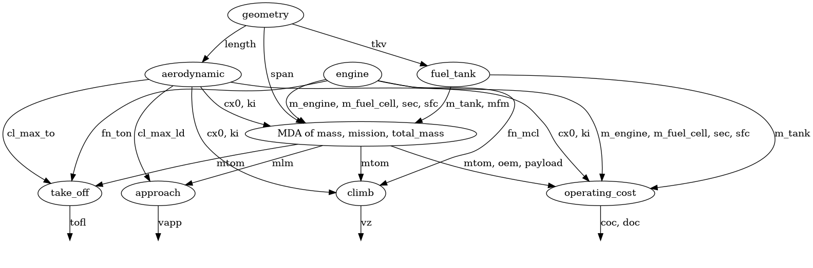

 Le graphe de couplage ci-dessus montre l'interdépendance des disciplines lors de la phase de conception préliminaire de l'aéronef.
 La discipline geometry est la racine du problème. Elle est totalement indépendante des autres disciplines internes mais conditionne l'ensemble de la chaîne de calcul. Elle alimente directement :
 - L'aérodynamique via la longueur du fuselage (length).
 - Le réservoir via le volume géométrique disponible dans la voilure (tkv).
 - Le bloc central de mission via l'envergure (span).
 alle modification des variables géométriques de conception aura donc un impact systémique par propagation sur l'intégralité du réseau.

 Le centre du processus repose sur le nœud MDA of mass, mission, total_mass. En ingénierie aéronautique, la masse maximale au décollage (MTOM), la masse à vide (OEM) et la consommation de carburant de mission sont interdépendantes (mlm, payload).

 Les blocs take_off, approach et climb reçoivent les caractéristiques aérodynamiques et les masses convergées pour calculer tofl pour la distance de décollage, vapp pour la vitesse d'approche, et vz pour la vitesse verticale.

 La discipline operating_cost sert de point de convergence final. Elle agrège les sorties de presque alles les disciplines amont (masses, spécificités moteurs, traînée aérodynamique) pour évaluer la viabilité économique à travers les coûts de mission (coc, doc).

## 1.1 Case 1 : Type de carburant : Kérosène :

### 1.1.1 Résolution déterministe du problème :

Dans un premier temps on va résoudre le problème d'une manière déterministe.

On teste deux algorithmes d'optimisation `COBYLA`et `SLSQP`:

- `NLOPT_COBYLA :` On n'a pas besoin de connaître les dérivés de la fonction objective ou de la fonction des contraintes. A chaque étape, un simplexe est construit à partir des points et évalue simplement la focntion en ces points. IL approche ensuite les focntions à minimiser par une courbe lineaire dans une zone de confiance pour deviner ou de trouve le minimum.
- `SLSQP :` Contrairement à COBYLA, SLSQP calcule à chaque étape la dérivée de la focntion objective et des contraintes et utilise le gradient de descente pour localiser l'optimum.

##### Historique d'optimisation avec COBYLA pour Max_iter = 200

  Évolution des critères, variables de décision et résidus pour un faible budget d'échantillonnage.

  

    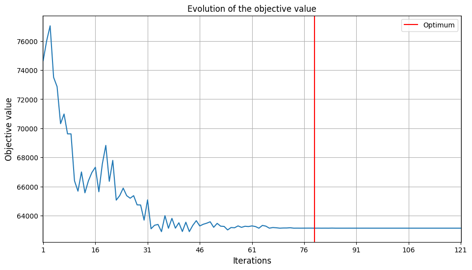
    <small style="display: block; margin-top: 5px; color: #555;">a) Fonction objectif ($MTOM$)</small>
  

  

    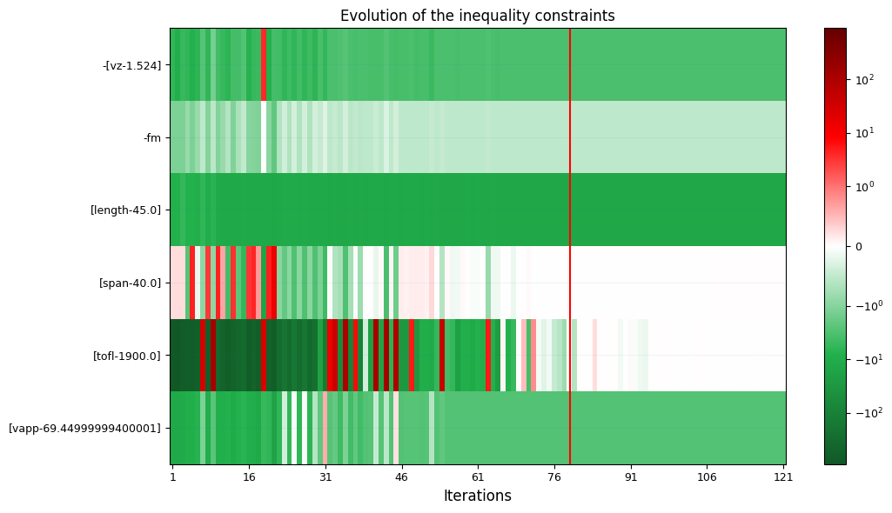
    <small style="display: block; margin-top: 5px; color: #555;">b) Respect des contraintes d'inégalité</small>
  

  

    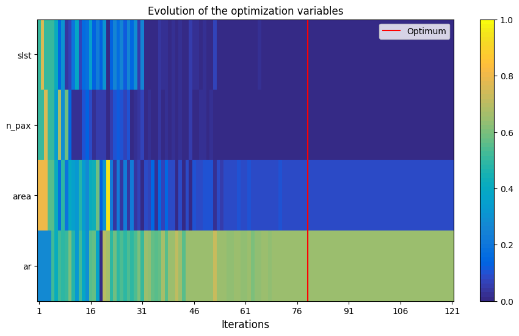
    <small style="display: block; margin-top: 5px; color: #555;">c) Évolution des variables de décision ($x$)</small>
  

  

    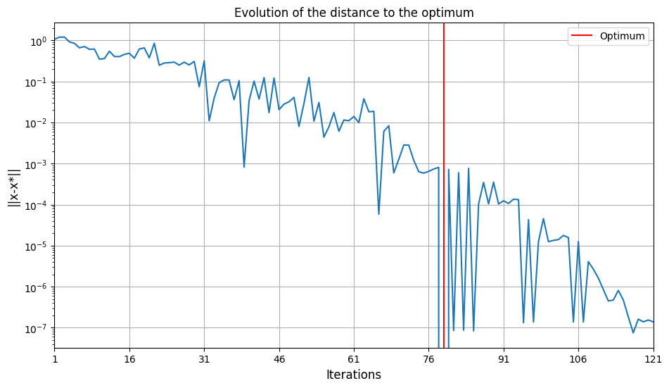
    <small style="display: block; margin-top: 5px; color: #555;">d) Norme de l'erreur $||x - x^*||$ (Log)</small>
  

---

##### Historique d'optimisation avec COBYLA pour Max_iter = 200

  Évolution des critères, variables de décision et résidus pour un budget d'échantillonnage de haute fidélité.

  

    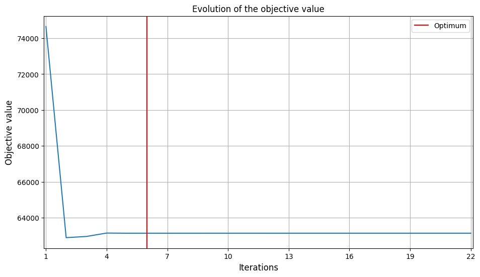
    <small style="display: block; margin-top: 5px; color: #555;">a) Fonction objectif ($MTOM$)</small>
  

  

    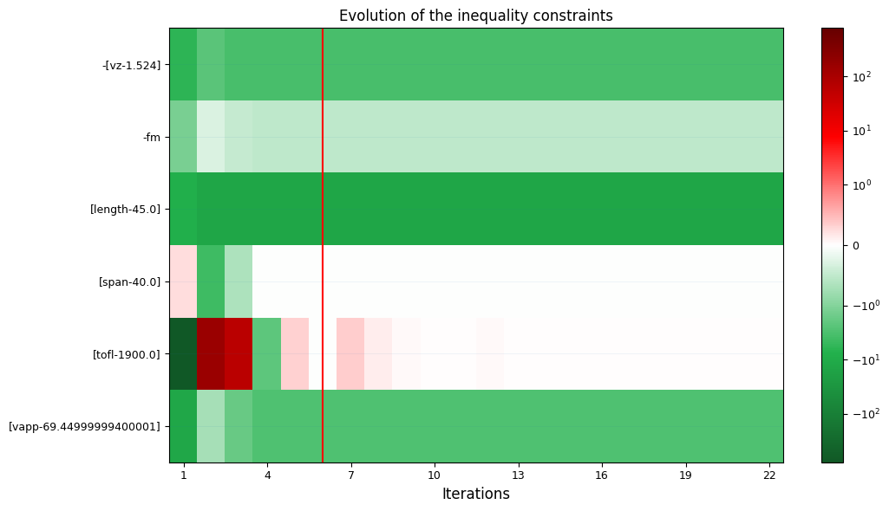
    <small style="display: block; margin-top: 5px; color: #555;">b) Respect des contraintes d'inégalité</small>
  

  

    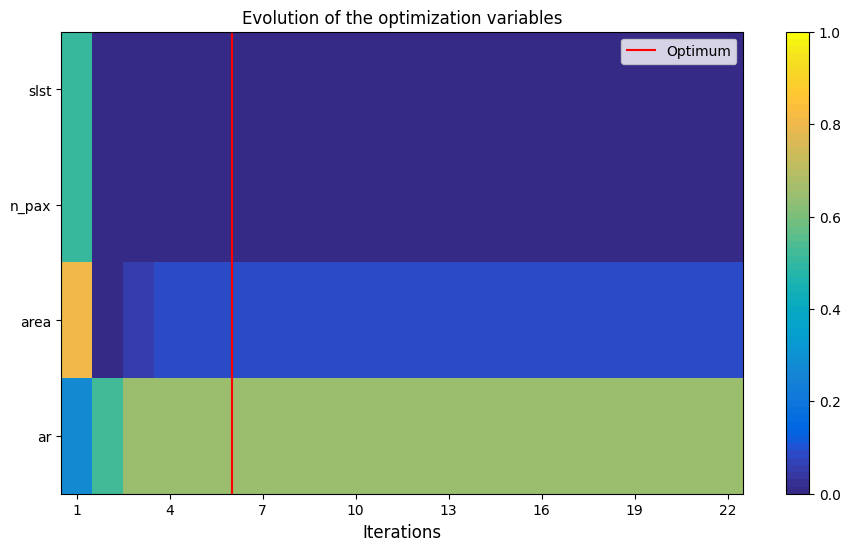
    <small style="display: block; margin-top: 5px; color: #555;">c) Évolution des variables de décision ($x$)</small>
  

  

    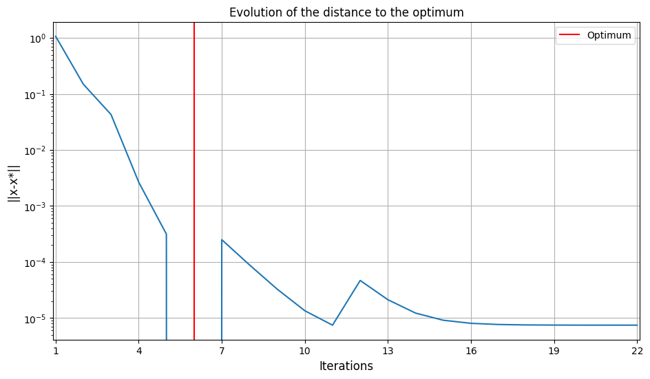
    <small style="display: block; margin-top: 5px; color: #555;">d) Norme de l'erreur $||x - x^*||$ (Log)</small>
  

On voit d'après l'historique de l'exécution des deux algorithmes que SLSQP réussit à trouver l'optimum à l'itération 6 beacoup plus rapidement que COBYLA qui le trouve à l'itération 80. La solution de ce dernier fluctue beaucoup avant de trouver l'optimum qui respecte toutes les contraintes. Il y a des contraintes qui sont largement respectées notamment vz, fm, length et vapp. Par contre span et tofl sont à la limite de la fonction des contraintes.
On voit que dans les deux cas la fonction objective fluctue au niveau des premières itération et converge ensuite et pareillement pour la courbe de $|x - x*|$ en échelle log qui atteint $\infty$ i.e. la $x$ atteint sa valeur otimale.

| Algorithme | COBYLA | SLSQP |
| -------- | -------- | -------- |
| max_iter = 50 | 63395.35 | 63138.119 |
| max_iter = 100  | 63138.089 | 63138.119 |
| max_iter = 500  | 63138.089 | 63138.119 |

On remarque que pour l'algorithme SLSQP, les résultats restent identique peu importe le nombre d'itération maximum que l'on impose. Ceci peu s'expliquer par la vitesse de converge de cet algorithme par descente de gradient par rapport à COBYLA. EN revanche, on remarque que à max_iter = 50, COBYLA n'a pas encore atteint son minimum mais il se stabilise à une valeur plus petite que celle de SLSQP prouvant qu'il a réussi à explorer la fonction à optimiser d'une manière beaucoup plus fine.

Dans la suite du projet on a fait donc le chois de travailler avec l'algorithme COBYLA.

### 1.1.2 Modèle suurogate

Dans un second temps on construit un métamodèle. On collecte des points de mesure en évaluant la discipline sur l'ensemble du design space et on génère ensuite deux bases de données distinctes contenant la variable de de conception x et les réponses associés dans ce cas la variables `mtom` et les 6 variables des contraintes.
Cela se fait de la manière suivante:

- Ce jeu d'netraînement est construit via `OT_OPT_LHS` i.e Hypercube Latin Optimisé qui permet d'échantilloner l'espace en garatissant que les points sont distribués de manière régulière et continue. Il est indiqué que le nombre de données d'entraînement doit être 3 à 5 fois la dimension de la variable en entrée dans ce cas [4 (dimension de x) + 6 (contraintes)] * 3~5 =  30~5.
- Le jeu de tets utilise un plan factoriel complet `OT_FULLFACT`. C'est un maillage sous forme de grille régulière qui couvre l'intégralité du domaine de conception. Il comporte 30² échantillons.
- On crée ensuite la surrogate discipline en utilisant l'algorithme RBFRegressor :
Le modèle approche $\hat{f} = \sum_{j=1}^{N_{train}} \omega_j.\psi(|x-x^{(j)}|)$ avec $\psi$ la fonction d'activation et $x^{(j)}$ le point d'entraînement j et $\omega_j $ le poid calculé lors de l'apprentissage.

La solution trouvée est la suivante :

| Variable | valeur |
| -------- | -------- |
| mtom | 63138.089 |
| slst  | 100000 |
| n_pax  | 120 |
| area  | 109.20 |
| ar  | 14.65 |

En évaluant la fonction en ce point on trouve que la solution n'est pas feasible i.e des contraintes ne sont pas respectées et/ou le modèle n'a pas appris ce qui veut dire que potentiellement la combinaison du nombre de données d'entraînement et l'algorithme RBFRegressor n'est pas optimale pour résoudre ce problème.
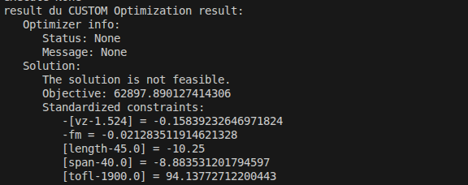

Même après avoir augmenté le nombre d'échantillon d'entraînement en allant jusqu'à 10000 la solution reste toujours not feasible. Afin de résoudre cette problématique on va tester plusieurs combinaison de nombre de données d'entraînement et d'algorithme d'optimisation.
| Métamodèle | Échantillons (N) | MTOM Surrogate (kg) | MTOM Réelle (kg) | Faisable (Réel) | Contraintes violées (valeur standardisée) |
|---|---|---|---|---|---|
| LinearRegressor | 30 | 63091.1 | 62749.0 | Non | [tofl-1900.0] (141.719) |
| LinearRegressor | 100 | 63171.6 | 62748.1 | Non | [tofl-1900.0] (141.666) |
| LinearRegressor | 1000 | 63187.0 | 62748.3 | Non | [tofl-1900.0] (141.680) |
| RBFRegressor | 30 | 65316.8 | 62850.5 | Non | [tofl-1900.0] (115.483), [vapp-69.44999999400001] (0.010) |
| RBFRegressor | 100 | 63649.6 | 63132.2 | Non | [tofl-1900.0] (4.756), [span-40.0] (0.036) |
| RBFRegressor | 1000 | 63398.2 | 63119.8 | Non | [tofl-1900.0] (5.852) |
| RandomForestRegressor | 30 | 69297.3 | 68663.1 | Non | -[vz-1.524] (0.260) |
| RandomForestRegressor | 100 | 66293.9 | 64123.9 | Oui | Aucune |
| RandomForestRegressor | 1000 | 65249.7 | 63518.9 | Non | [tofl-1900.0] (21.932) |

La seule combinaison qui permet donc d'avoir une solution feasible est RandomForestRegressor + N=100. Ce qui donne comme solution :

VALEURS A MODIFIER
| Variable | valeur |
| -------- | -------- |
| mtom | 63138.089 |
| slst  | 100000 |
| n_pax  | 120 |
| area  | 109.20 |
| ar  | 14.65 |

## 1.2 Case 2 : Type de carburant : Hydrogène :

### 1.2.1 Résolution déterministe du problème :

L'optimisation directe est menée avec l'algorithme COBYLA limité à un budget maximal de 100 itérations.

L'algorithme converge rapidement dès la 25ème itération vers une solution feasible, dont les caractéristiques géométriques et de performance sont résumées ci-dessous :

| Variable | valeur |
| -------- | -------- |
| mtom | 63323.833 |
| slst  | 100000 |
| n_pax  | 120 |
| area  | 119.91 |
| ar  | 9.86 |

À l'optimum déterministe, l'avion sature ses bornes minimales de capacité n_pax = 120 et de poussée slst = 100 kN. L'optimiseur ajuste la géométrie avec une surface alaire de 119.91 m2 et un allongement modéré de 9.86 afin de maximiser la portance nécessaire tout en respectant la vitesse d'approche maximale autorisée.

### 1.2.2 Modèle suurogate

On effectue la même recherche croisée afin de trouver la meilleure combinaison entre l'algorithme d'optimisation et le $N_{test}$ :

| Métamodèle | Échantillons (N) | MTOM Surrogate (kg) | MTOM Réelle (kg) | Faisable (Réel) | Contraintes violées (valeur standardisée) |
|---|---|---|---|---|---|
| LinearRegressor | 30 | 64573.3 | 64229.1 | Oui | Aucune |
| LinearRegressor | 100 | 64622.2 | 64244.5 | Oui | Aucune |
| LinearRegressor | 1000 | 64759.5 | 64249.6 | Oui | Aucune |
| RBFRegressor | 30 | 65050.2 | 63467.5 | Non | [vapp-69.44999999400001] (0.383) |
| RBFRegressor | 100 | 64170.3 | 63510.7 | Oui | Aucune |
| RBFRegressor | 1000 | 63576.9 | 63372.2 | Oui | Aucune |
| RandomForestRegressor | 30 | 69468.3 | 68064.6 | Non | -fm (0.203) |
| RandomForestRegressor | 100 | 67750.9 | 64648.8 | Non | [vapp-69.44999999400001] (2.517), -fm (0.078) |
| RandomForestRegressor | 1000 | 66086.0 | 65597.4 | Oui | Aucune |

On choisit RBFRegressor + $N_{train}$ c'est celle qui minimise le plus `mtom` sans pour avoir un budget élever en terme de l'échantillon d'entraînement.

| Variable | valeur |
| -------- | -------- |
| mtom | 63764.80 |
| slst  | 100000 |
| n_pax  | 120 |
| area  | 119.90 |
| ar  | 9.86 |

## 1.3 Comparaison des deux avions kérosène et hydrogène :
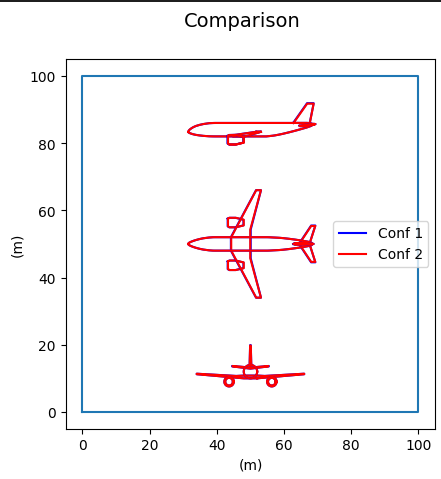

| Variable | Kérosène | Hydrogène |
| -------- | -------- | -------- |
| mtom | 63323.833 |  63138.089 |
| slst  | 100000 | 100000 |
| n_pax  | 120 | 120 |
| area  | 119.91 | 109.20 |
| ar  | 9.86 | 14.65 |

Malgré les deux différences de l'aile de l'avion entre les deux cas on remarque que les deux avions sont confondus.

