# 3 Problème 3 : Surrogate model et optimisation :
Ce problème concerne la création d'un modèle surrogate de $\hat{f}:x,u\mapsto \hat{f}(x,u)=f(x,u)$ pour approximer l'objectif et les contraintes du problème de conception, en tenant compte à la fois des paramètres de conception et des paramètres incertains. Ensuite, nous utiliserons ce modèle de substitution pour rechercher le meilleur concept d'aéronef, en prenant en considération l'incertitude des choix technologiques.

L'espace d'entrée globale contient 11 variables = 3 variables de décision + 7 variables incertaines + 1 constante.

Le problème de conception multidisciplinaire d'aéronef consiste à minimiser la fonction $f$ tout en respectant les contraintes, malgré la présence des fluctuations aléatoires définies dans l'espace des paramètres uncertains.
Le problème est ainsi :
$min(E[f(x,u)])$ 

Pour les constaintes de performance : $\mathbb{E}[c_i​(x,u)]+k⋅\mathbb{S}[g​(x,u)]≤0$
avec : 
- g(x,u) est la fonction de containtes.
- S est l'écart type mesurant la dispersion et le risque induit par les incertitudes.
- k est le facteur de marge de sécurité qui définit le niveau de risque acceptableface aux incertitudes.

La variable $x$ reste inchangée et est égale à celle de problème 1 et pareil pour les contraintes. En revanche la variable $u$ est définie de la manière suivante : 

#### Les paramètres uncertains : la variable u

| Variable | Description | Distribution | Type de carburant | Type d'engin |
| -------- | -------- | -------- | -------- | -------- | 
| gi  | Indicateur géométrique | T(0.35, 0.4, 0.405) | liquid_h2 | all |
| vi  | Vitesse (kt) | T(0.755, 0.800, 0.805) | liquid_h2 | all |
| aef  | Facteurs d'efficacité | T(0.99, 1., 1.03) | all | all |
| cef  | Facteurs d'efficacité | T(0.99, 1., 1.03) | all | all |
| sef  | Facteurs d'efficacité | T(0.99, 1., 1.03) | all | all |

## 3.1 Case 1 : Type de carburant kérosène : 

Dans cette partie on va traiter le premier cas du problème 3 qui concerne le kérosène comme type de carburant, Turbofan comme type de moteur et 5500 km comme portée de conception. 

### 3.1.1 Les critères d'optimisation : 

- Comme on chercher à minimiser l'espérance on définit "Mean" comme un critère d'optimisation.
- La formulation MDF: Multidisciplinary Design Feasible permet de garantir la convergence de toutes les intéractions et boucle de couplage entre disciplines.
- Algorithme `COBYLA`: Contrairement aux algorithmes de descente classiques, COBYLA avance en évaluant uniquement les valeurs des fonctions. De plus c'est cet algorythime là que l'on a choisit au niveau du problème 1. 
- Pour évaluer l'espérence $E$ et l'écart-type $\mathbb{S}$ à chaque itération, l'optimiseur doit propager les incertitudes à travers les disciplines. Trois approches peuvent être utilisées : 

#### a. L'approche avec `surrogate_settings`:

Cette méthode s'appuie sur la construction préalable de l'approxiamation de $\hat{f}(x,u)$ par krigeage. 

$$ \mathbb{E}[f(x,u)]  \approx \frac{1}{N} \sum_{j=1}^{N}\hat{f}(x, u^j)  $$
Avec N le nombre d'échantillonage.

##### Historique d'optimisation pour N = 50 échantillons

  Évolution des critères, variables de décision et résidus pour un faible budget d'échantillonnage.

  

    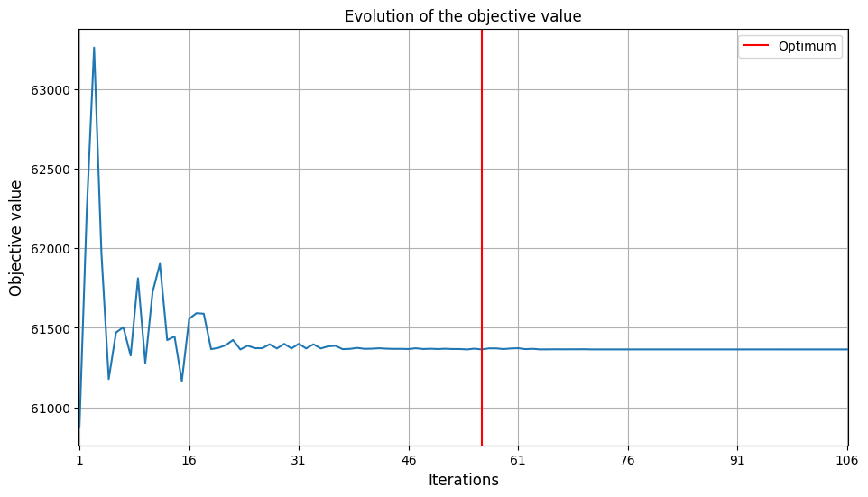
    <small style="display: block; margin-top: 5px; color: #555;">a) Fonction objectif ($MTOM$)</small>
  

  

    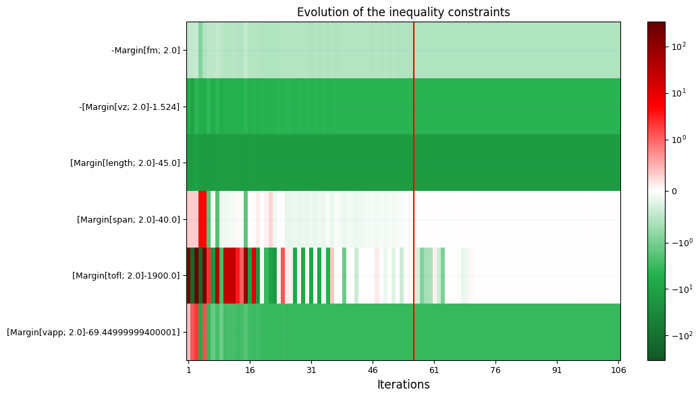
    <small style="display: block; margin-top: 5px; color: #555;">b) Respect des contraintes d'inégalité</small>
  

  

    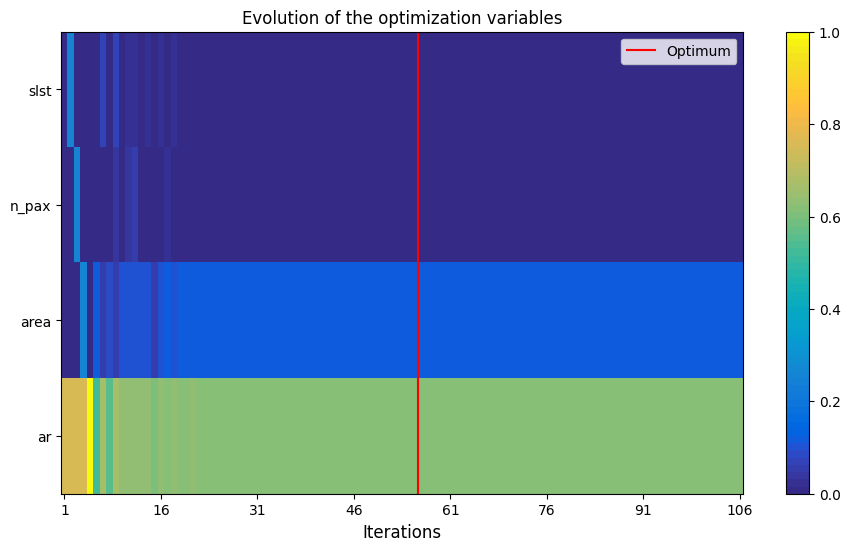
    <small style="display: block; margin-top: 5px; color: #555;">c) Évolution des variables de décision ($x$)</small>
  

  

    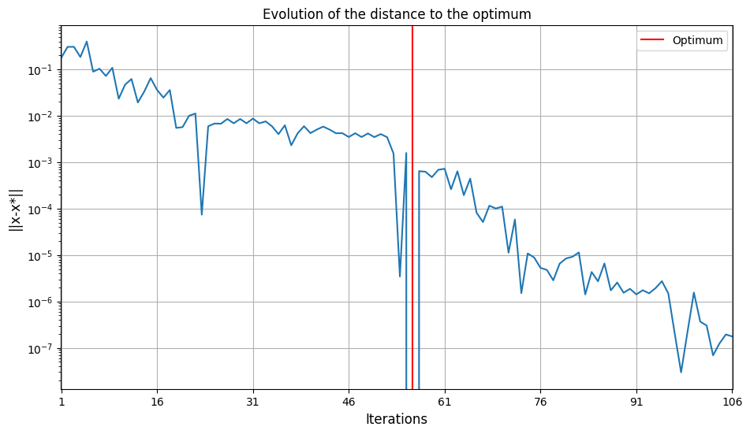
    <small style="display: block; margin-top: 5px; color: #555;">d) Norme de l'erreur $||x - x^*||$ (Log)</small>
  

---

##### Historique d'optimisation pour N = 200 échantillons

  Évolution des critères, variables de décision et résidus pour un budget d'échantillonnage de haute fidélité.

  

    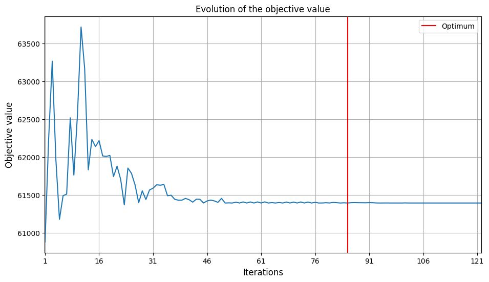
    <small style="display: block; margin-top: 5px; color: #555;">a) Fonction objectif ($MTOM$)</small>
  

  

    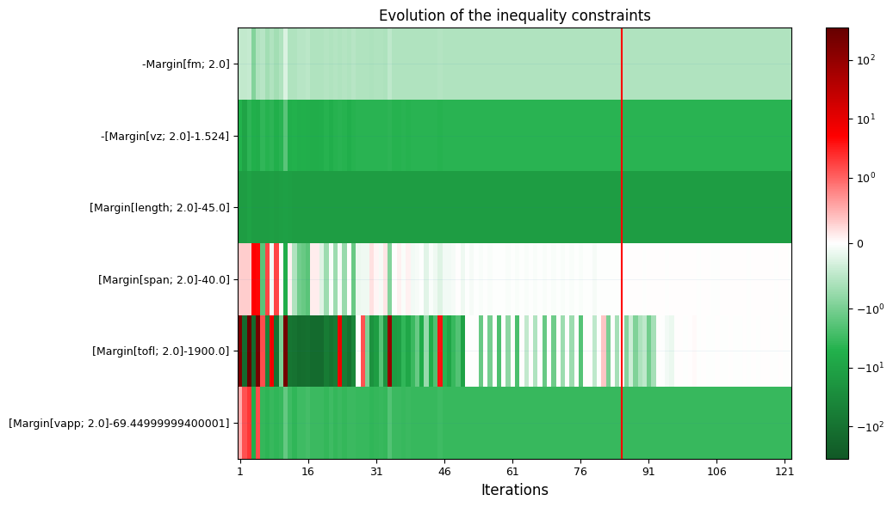
    <small style="display: block; margin-top: 5px; color: #555;">b) Respect des contraintes d'inégalité</small>
  

  

    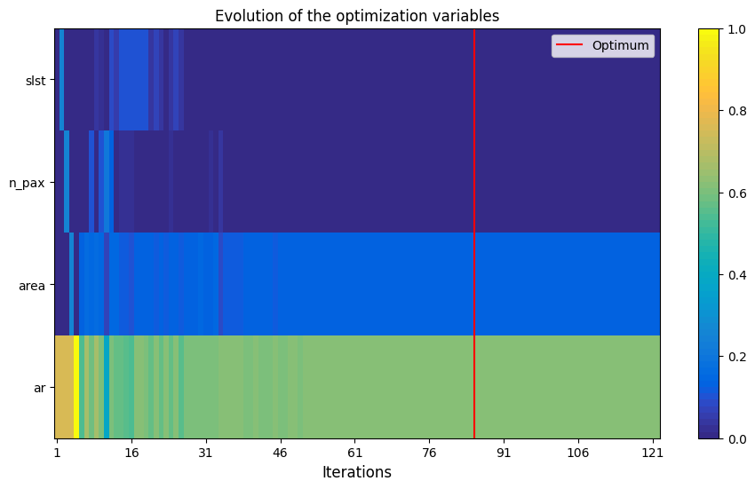
    <small style="display: block; margin-top: 5px; color: #555;">c) Évolution des variables de décision ($x$)</small>
  

  

    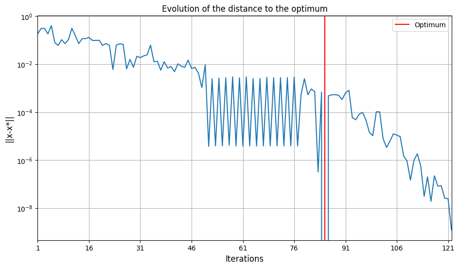
    <small style="display: block; margin-top: 5px; color: #555;">d) Norme de l'erreur $||x - x^*||$ (Log)</small>
  

| Variable | $N=50$ (Sol feasible) | $N=200$ (sol feasible) |
| -------- | -------- | -------- |  
| mtom | 61346.41 | 61395.363  |  
| slst | 100000 | 100000  |  
| n_pax | 120| 120  |  
| area | 111.88 | 112.542  |  
| ar | 14.30 | 14.216 |  

On pourrait penser qu'avec plus de données d'entraînement le problème sera plus précis et converge plus vite mais d'après les résultats c'est l'inverse qui se passe propbablement à cause de la réduction du bruit qui s'accumule à travers les itérations. Cependant, on pourrait quand même penser qu'avec $N=50$ l'optimiseur converge prématurément à l'itération $\approx 55$ COBYLA a trouvé une configuration plus légere sur les 50 points testés et en testant avec beaucoup plus de données on impose un spectre de scénarios plus large, on prend l'exemple de la surface de l'aile qui est passé de $111.88 m²$ à $112.54$ ce qui offre plus de protance au décollage mais un aile plus grand sugnifie un poids plus lourd pour l'avion. Tout ceci explique que le problème prend plus de temps pour converger $\approx 80$ itérations. Dans la suite de ce cas, uniquement N=200 sera utilisé pour illustrer le reste des méthodes.
On voit que dans les deux cas la fonction objective fluctue au niveau des premières itération et converge ensuite et pareillement pour la courbe de $|x - x*|$ en échelle log qui atteint $\infty$ i.e. la $x$ atteint sa valeur otimale.
Quant au graphe des constraintes, dans les deux cas les contraintes de fm, vz, length te vapp sont largement respectés. En revanche, span et tofl la fonction des conraintes est nulle. 
 

#### b. L'approche avec `sampling_settings`:

L'échantillonage direct applique la méthode de Monté-Carlo sur le modèle multidisciplinaire. 

$$\mathbb{E}[f(x^{(k)}, u)] \approx \frac{1}{N} \sum_{j=1}{N} f(x^{(k)}, u^{(j)})$$
A chaque itération k de l'optimiseur, on génère N=200 réalisations i.i.d du vecteur des variables uncertaines $(u^(1), u^(2) ...., u^(N))$ et pour chaque échantillon j, l'analyse multidisciplinaire est entièrement résolues. 

#### c. L'approche avec `TaylorPolynomial_settings`:

L'approche basée sur les polynômes de Taylor repose sur une stratégie de propagation des incertitudes différente par rapport à l'approche d'avant. Au lieu de faire des tirages aléatoires répétés, elle s'appuie sur un développement de Taylor de premier ordre; 
$$f(x, U) \approx f(x, \mu) + (U, \mu)f'(x, \mu) $$ Avec $\mu=\mathbb{E}$$
Comme $\mathbb{E}[U - \mu] = 0$ alors $ \mathbb{E}[f(x, U)] \approx f(x, \mu)$ et $\mathbb{V}[f(x, U)] \approx \sigma²(f'(x, \mu))²$  avec $\sigma²$ la variance de $U$. 
L'écart-type $\mathbb{S}$ découle directement directement de la racine carré de la variance $\mathbb{V}$

| Variable | MC(sol feasible) | Taylor(sol feasible)
| -------- | -------- | -------- |  
| mtom |  61488.599  |  61713.022 |
| slst |  100000  |  105694.36 |
| n_pax |  120  |  120 |
| area |  114.86  |  112.95 |
| ar |  13.92 |  14.16 |

##### Historique d'optimisation pour la méthode MC

  Évolution des critères, variables de décision et résidus pour un budget d'échantillonnage de haute fidélité.

  

    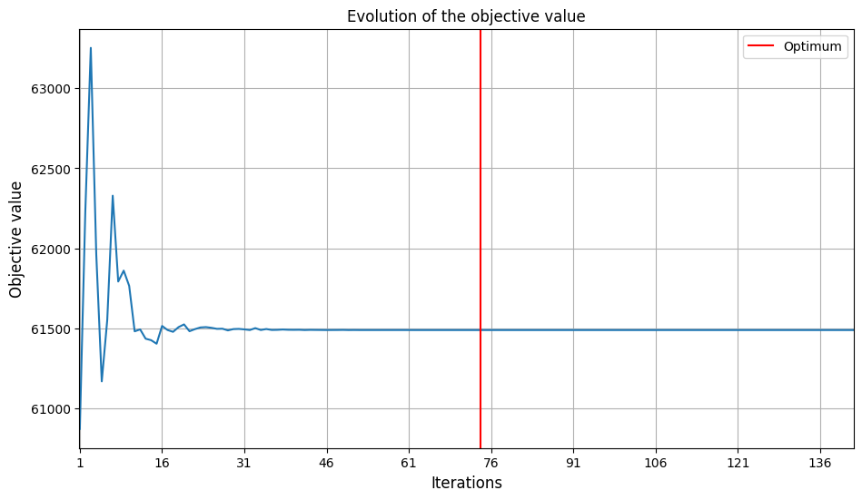
    <small style="display: block; margin-top: 5px; color: #555;">a) Fonction objectif ($MTOM$)</small>
  

  

    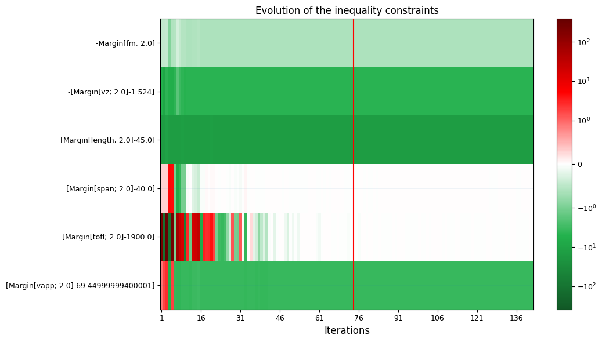
    <small style="display: block; margin-top: 5px; color: #555;">b) Respect des contraintes d'inégalité</small>
  

  

    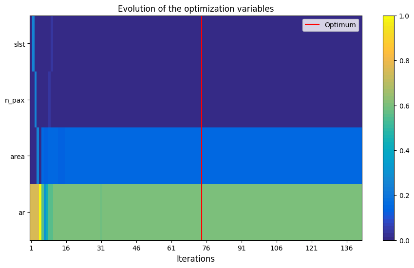
    <small style="display: block; margin-top: 5px; color: #555;">c) Évolution des variables de décision ($x$)</small>
  

  

    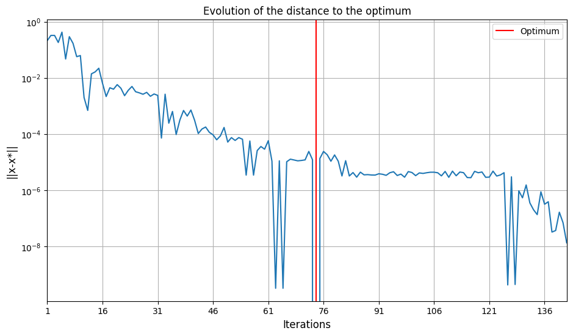
    <small style="display: block; margin-top: 5px; color: #555;">d) Norme de l'erreur $||x - x^*||$ (Log)</small>
  

---

##### Historique d'optimisation pour la méthode de Taylor

  Évolution des critères, variables de décision et résidus pour un budget d'échantillonnage de haute fidélité.

  

    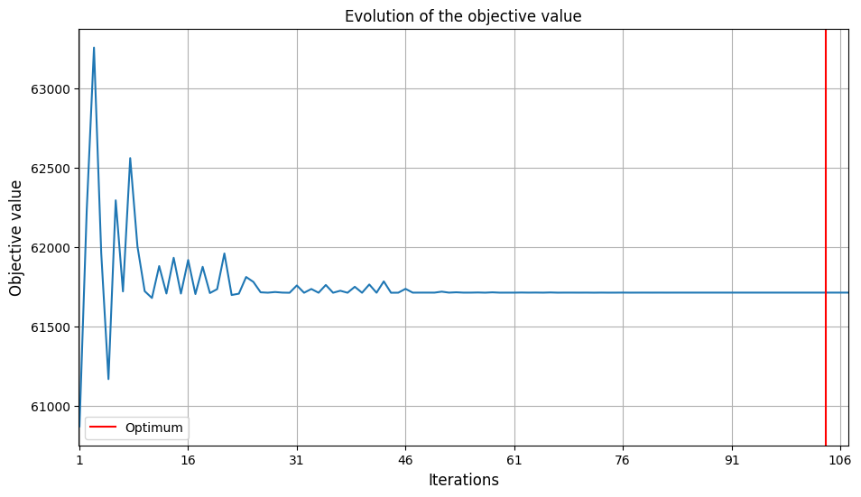
    <small style="display: block; margin-top: 5px; color: #555;">a) Fonction objectif ($MTOM$)</small>
  

  

    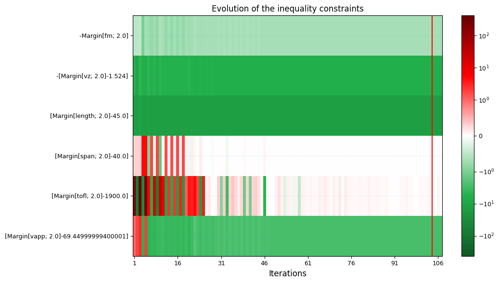
    <small style="display: block; margin-top: 5px; color: #555;">b) Respect des contraintes d'inégalité</small>
  

  

    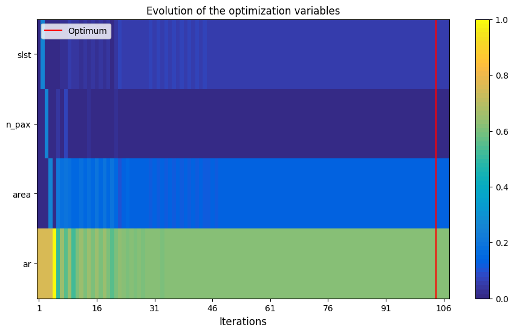
    <small style="display: block; margin-top: 5px; color: #555;">c) Évolution des variables de décision ($x$)</small>
  

  

    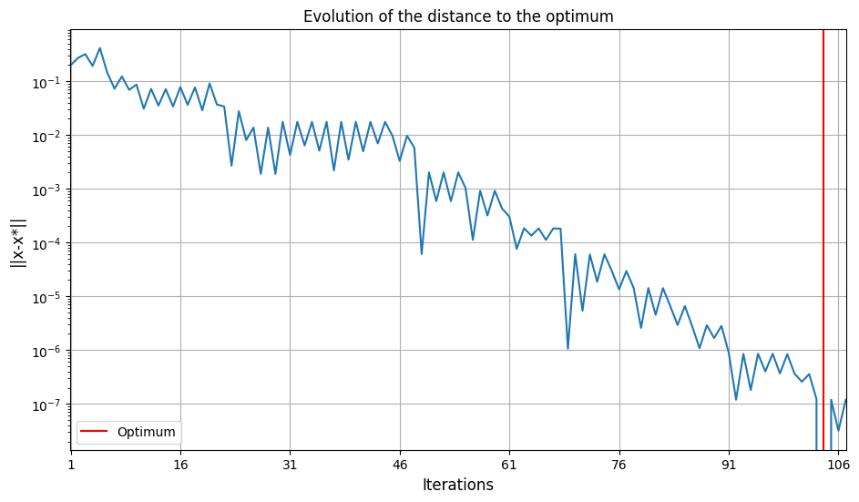
    <small style="display: block; margin-top: 5px; color: #555;">d) Norme de l'erreur $||x - x^*||$ (Log)</small>
  

La méthode de Taylor prend beacoup plus de temps à converger $\approx 106$ itérations contre $\approx 74$ pour la méthode de MC et passe plus soucent par des phases de non-respect des contraintes jusqu'à converger très lentement. Ce qui s'explique par le fait que la méthode MC a plus de vision avec les 200 points à chaque étape alors que le méthode de Taylor exploite plusieurs optimums locaux avant de trouver le minimum qui satisfait toutes les contraintes.

La méthode de Taylot choisit une solution plus radicale que les deux premières pour la poussé des moteurs (slst) et réduit par conséquent la surfaces des ailes (plus de facilité à décoller avec la poussée des moteurs). Tout ceci se traduit par un poids maximale de l'avion plus lourd.

L'approche MC bien que plus lourde numériquement, donne une trajectoire d'optimisation plus lisse et efficace ce qui conduit à un avion final plus plus léger et mieux optimisé.

