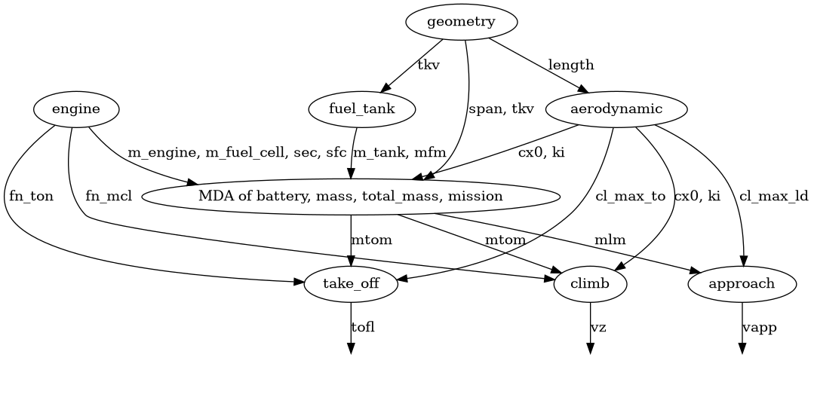
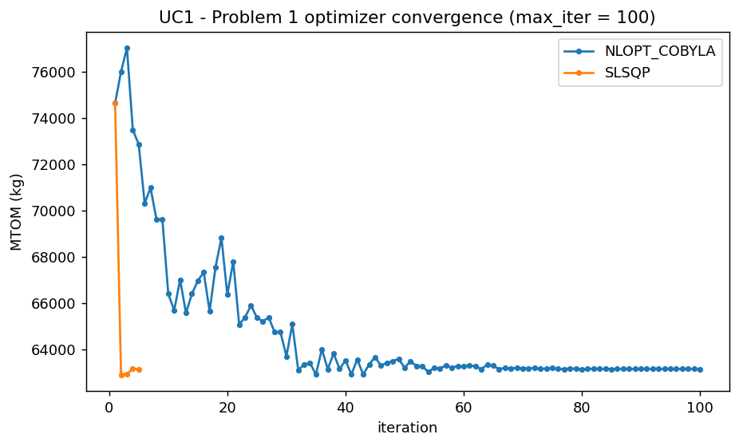
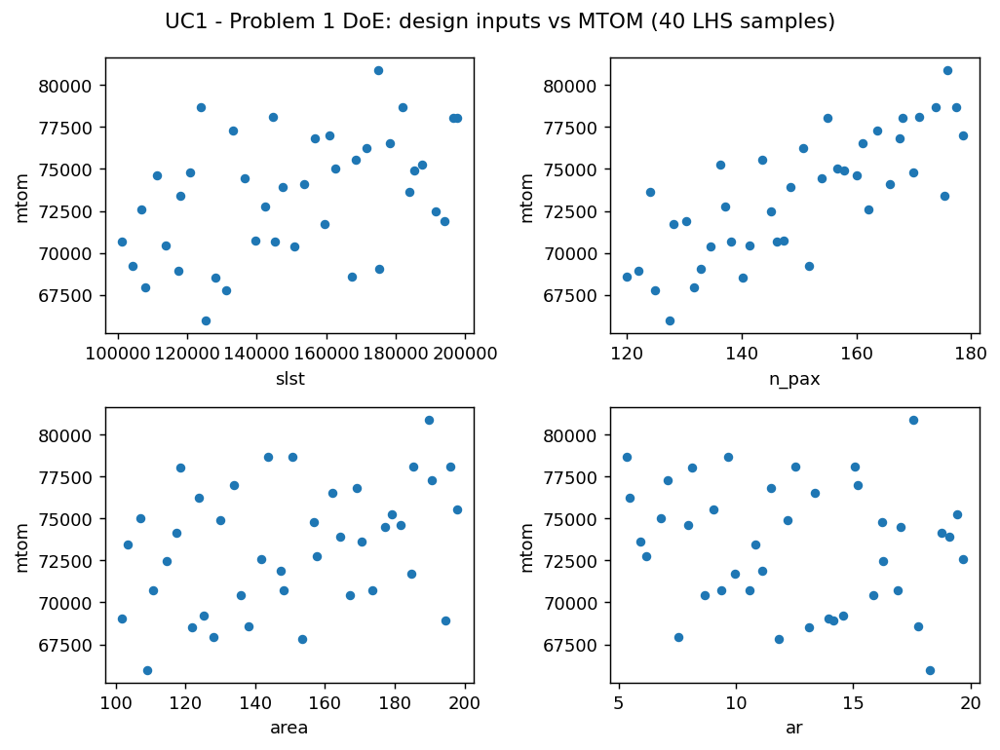
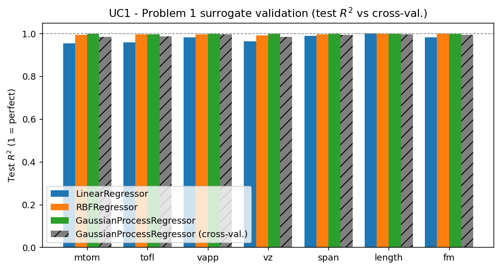
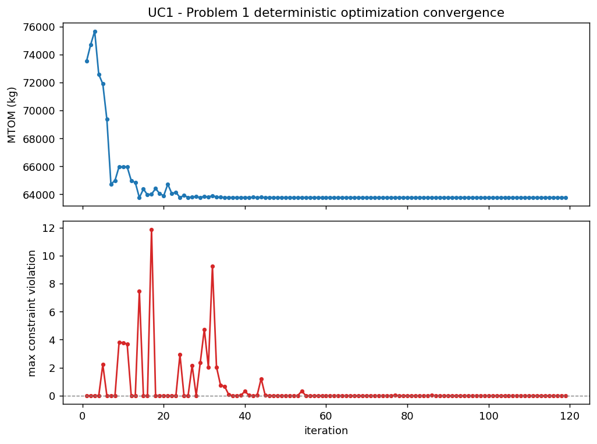
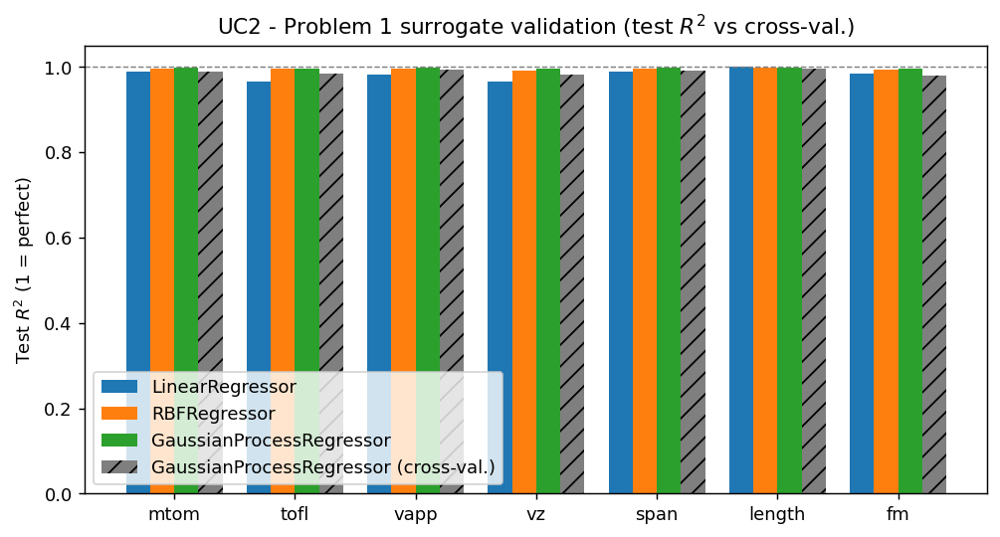
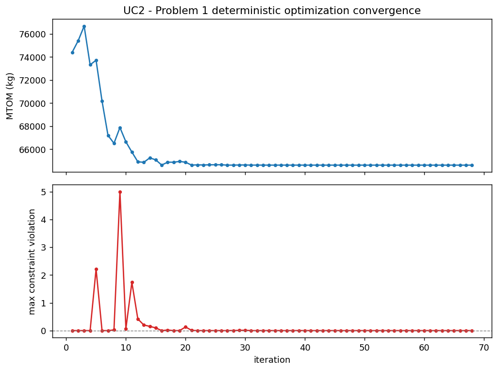
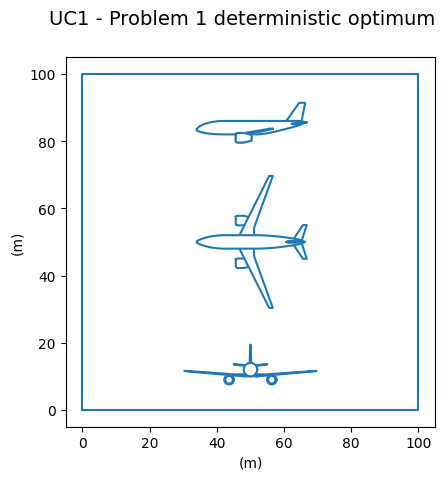
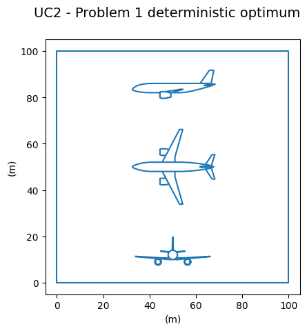

# Partie 1 — Modèle surrogate et optimisation déterministe

## Objectif et formulation

Le Problème 1 fige les incertitudes technologiques à leurs valeurs nominales et ne
fait varier que les quatre paramètres de conception
$x = (\texttt{slst}, \texttt{n_pax}, \texttt{area}, \texttt{ar})$. On cherche la
conception qui minimise la masse maximale au décollage sous les six contraintes
opérationnelles :

$$
\min_{x} \; \texttt{mtom}(x, u_{\text{nom}})
\quad \text{sous} \quad g(x, u_{\text{nom}}) \le 0,
$$

où $g$ regroupe les contraintes `tofl` $\leq$ 1900 m, `vapp` $\leq$ 135 kt,
`vz` $\geq$ 300 ft/min, `span` $\leq$ 40 m, `length` $\leq$ 45 m et `fm` $\geq$ 0 %.

Les fonctions exactes étant supposées coûteuses à l'évaluation, la démarche, appliquée
successivement aux deux cas d'usage, est la suivante :

1. **optimiser directement sur le vrai modèle** (sans surrogate) pour disposer
   d'une conception de référence $x^\star$, en choisissant l'algorithme et le
   budget d'itérations ;
2. **construire un surrogate** $\hat{f}(x)$ en étudiant la taille du plan
   d'expériences et l'erreur d'approximation ;
3. **optimiser sur le surrogate puis valider la solution sur le vrai modèle**, et
   comparer les optima ;
4. **comparer les deux cas d'usage** kérosène et hydrogène liquide.

Le modèle OAD est un système multidisciplinaire : la masse au décollage est
solution d'une boucle de rétroaction (`mass` $\leftrightarrow$ `total_mass` $\leftrightarrow$ `mission`), résolue
par une analyse multidisciplinaire (MDA) à chaque évaluation. Le graphe de couplage
condensé l'illustre : `geometry` conditionne toute la chaîne (longueur de fuselage,
volume de réservoir, envergure), le cœur fortement couplé converge la masse, et les
blocs `take_off`, `approach`, `climb` en déduisent `tofl`, `vapp`, `vz`.

---

## Cas d'usage 1 — Kérosène / Turbofan

### 1. Optimisation directe sur le vrai modèle (sans surrogate)

On résout d'abord le problème directement sur le modèle couplé (formulation MDF,
qui garantit la convergence de la MDA à chaque itération). Deux algorithmes sont
comparés :

- **`NLOPT_COBYLA`** (sans gradient) : à chaque étape, un simplexe est construit à
  partir des évaluations et approxime localement l'objectif et les contraintes dans
  une région de confiance. Aucune dérivée n'est requise.
- **`SLSQP`** (par gradient) : utilise les dérivées de l'objectif et des
  contraintes (estimées ici par différences finies) pour suivre une direction de
  descente.

Le MTOM optimal obtenu en fonction du budget d'itérations est :

| max_iter | COBYLA | SLSQP |
|:---:|:---:|:---:|
| 50 | 63 395,4 | 63 144,2 |
| 100 | 63 138,1 | 63 144,2 |
| 500 | 63 138,1 | 63 144,2 |

SLSQP converge très vite (sa solution est identique dès 50 itérations) mais se
stabilise à 63 144 kg. COBYLA, plus lent, explore plus finement et atteint un MTOM
légèrement inférieur (**63 138 kg**) à partir de 100 itérations. L'écart est faible
($\approx$ 6 kg, 0,01 %), mais comme COBYLA n'exige pas de dérivées, coûteuses et bruitées
par différences finies sur le vrai modèle, **on retient COBYLA pour la suite du
projet**. La conception de référence sature les bornes inférieures de poussée
(`slst` = 100 kN) et de passagers (`n_pax` = 120), réduction directe de la masse.

### 2. Modèle surrogate et taille du plan d'expériences

On échantillonne le vrai modèle sur l'espace de conception (4-D, $u$ gelé) par
hypercube latin optimisé (`OT_OPT_LHS`), avec un plan d'entraînement et un plan de
test indépendants. La règle de dimensionnement recommandée est de **3 à 5 fois la
dimension d'entrée** ; on retient ici un plan un peu plus fourni (40 points,
soit 10 $\times$ dim) car la sortie `tofl` est fortement non linéaire, ce qui suffit à
obtenir un surrogate fidèle (vérifié ci-dessous).

Trois régresseurs sont comparés sur le plan de test : **linéaire**, **RBF**
(fonctions de base radiales) et **krigeage** (processus gaussien), et le meilleur
R$^{2}$ moyen est conservé, conformément à la règle « commencer simple ». Le krigeage
l'emporte sur toutes les sorties :

| Régresseur | R$^{2}$ test `mtom` | R$^{2}$ test (min sur sorties) |
|:---|:---:|:---:|
| LinearRegressor | 0,955 | 0,955 |
| RBFRegressor | 0,994 | 0,992 |
| **GaussianProcessRegressor** | **0,998** | **0,997** |

Le plan d'expériences étant petit, un découpage train/test unique peut être
optimiste. Une **validation croisée K-fold** du krigeage donne un R$^{2}$ $\geq$ 0,98 sur
toutes les sorties (`mtom` 0,983, `vapp` 0,995, `length` 0,996), proche du R$^{2}$ de
test : il n'y a pas de sur-apprentissage. Les barres hachurées de la figure
montrent cet accord. L'augmentation de la taille du plan (étude de la section
suivante) améliore marginalement l'erreur, ce qui confirme qu'un plan modéré
suffit.

### 3. Optimisation sur le surrogate et validation sur le vrai modèle

On optimise ensuite avec COBYLA sur le surrogate (peu coûteux). L'optimiseur
converge vers une conception différente de la référence directe :

| Variable | Optimum surrogate |
|:---|:---:|
| `slst` | 100 kN *(borne inf.)* |
| `n_pax` | 120 *(borne inf.)* |
| `area` | 100,8 m$^{2}$ |
| `ar` | 15,3 |
| `mtom` (surrogate) | 63 781 kg |

**Validation sur le vrai modèle.** Le surrogate n'étant qu'une approximation, on
ré-évalue cette conception sur le modèle couplé. Le MTOM réel est de **62 779 kg**,
mais la contrainte de **distance de décollage est violée** : `tofl` $\approx$ 2 030 m pour
une limite de 1 900 m (+130 m). L'optimiseur a poussé la surface alaire à sa valeur
minimale ($\approx$ 101 m$^{2}$) et l'allongement à $\approx$ 15,3 en exploitant l'erreur résiduelle du
surrogate à la frontière de la contrainte active `tofl` : c'est un cas classique
d'**exploitation du métamodèle** (« surrogate exploitation »). La conception
directe de la section 1 (63 138 kg, faisable) est donc préférable comme référence,
et l'optimum surrogate doit être corrigé par une marge de sécurité.

Pour quantifier ce phénomène, on balaie le couple (métamodèle, taille $N$ du plan
d'expériences) et on vérifie chaque optimum sur le vrai modèle :

| Métamodèle | $N$ | MTOM surrogate (kg) | MTOM réel (kg) | Faisable (réel) | Contrainte violée |
|:---|:---:|:---:|:---:|:---:|:---|
| LinearRegressor | 30 | 63 091 | 62 749 | Non | `tofl` (+142) |
| LinearRegressor | 100 | 63 172 | 62 748 | Non | `tofl` (+142) |
| LinearRegressor | 1000 | 63 187 | 62 748 | Non | `tofl` (+142) |
| RBFRegressor | 30 | 65 317 | 62 851 | Non | `tofl` (+115) |
| RBFRegressor | 100 | 63 650 | 63 133 | Non | `tofl` (+4,7), `span` |
| RBFRegressor | 1000 | 63 398 | 63 120 | Non | `tofl` (+5,9) |
| RandomForestRegressor | 30 | 68 903 | 66 767 | **Oui** | aucune |
| RandomForestRegressor | 100 | 66 319 | 64 094 | Non | `tofl` (+51) |
| RandomForestRegressor | 1000 | 65 310 | 63 502 | **Oui** | aucune |

La majorité des couples donne un optimum **infaisable** sur le vrai modèle,
en violant la distance de décollage. La régression linéaire reste infaisable quel
que soit $N$ (biais trop fort sur la courbure de `tofl`), tandis que le RBF s'en
rapproche en augmentant $N$ (violation tombant à quelques mètres). Le Random Forest
à $N=30$ produit un avion conservateur et trop lourd (66 767 kg), artefact de son
comportement par paliers ; en revanche, à $N=1000$ il converge vers une conception
faisable à 63 502 kg, soit seulement +364 kg au-dessus de la référence directe.
Ce résultat reste toutefois plus lourd que l'optimum direct, et la faisabilité
dépend du caractère conservateur du Random Forest plutôt que d'une modélisation
précise des contraintes. Cette étude illustre les directives du projet : **un
surrogate n'est qu'une approximation, et toute solution optimisée dessus doit être
validée sur le vrai modèle**.

---

## Cas d'usage 2 — Hydrogène liquide / Turbofan

La même démarche est reconduite pour l'hydrogène liquide. Le réservoir
cryogénique alourdit et agrandit le fuselage, ce qui durcit les contraintes
géométriques et de masse.

### 1. Optimisation directe et choix de l'algorithme

| max_iter | COBYLA | SLSQP |
|:---:|:---:|:---:|
| 50 | 63 323,8 | 63 532,5 |
| 100 | 63 323,8 | 63 532,5 |
| 500 | 63 323,8 | 63 532,5 |

Ici **COBYLA est nettement meilleur** (63 324 kg contre 63 533 kg pour SLSQP, soit
-209 kg), confirmant le choix de l'algorithme sans gradient. Comme pour le
kérosène, l'optimum sature `slst` = 100 kN et `n_pax` = 120.

### 2. Surrogate et validation

Le krigeage est de nouveau le plus précis (R$^{2}$ test `mtom` : linéaire 0,989, RBF
0,996, **krigeage 0,998**), avec une validation croisée concordante (R$^{2}$ `mtom`
0,988). Le surrogate est donc fiable.

### 3. Optimisation sur surrogate et validation

| Variable | Optimum surrogate |
|:---|:---:|
| `slst` | 100 kN *(borne inf.)* |
| `n_pax` | 120 *(borne inf.)* |
| `area` | 110,9 m$^{2}$ |
| `ar` | 9,38 |
| `mtom` (surrogate) | 64 624 kg |

Sur le vrai modèle, cette conception donne un MTOM réel de **63 288 kg**. Les
contraintes sont presque toutes respectées (`tofl` 1 880 m, `vz` 1,89 m/s,
`span` 32,3 m, `length` 34,8 m), mais la **vitesse d'approche dépasse légèrement la
limite** (`vapp` $\approx$ 69,7 m/s contre 69,45 m/s, soit +0,25 m/s) et la marge de
carburant est quasi nulle (`fm` $\approx$ 0,04). L'exploitation du surrogate est ici
beaucoup plus modérée que pour le kérosène (où `tofl` était violée de 130 m), mais
le constat est le même : **l'optimum nominal sature les contraintes** et n'a aucune
marge face aux incertitudes, ce qui motive l'optimisation robuste de la Partie 3.

Le balayage (métamodèle, $N$) confirme que, contrairement au kérosène, la configuration
hydrogène admet plusieurs configurations faisables (régression linéaire à tout $N$,
RBF à $N \ge 100$), mais toujours au prix d'un MTOM plus élevé que l'optimum
saturé :

| Métamodèle | $N$ | MTOM réel (kg) | Faisable (réel) |
|:---|:---:|:---:|:---:|
| LinearRegressor | 30 / 100 / 1000 | $\approx$ 64 230-64 250 | Oui |
| RBFRegressor | 100 / 1000 | 63 510 / 63 372 | Oui |
| RandomForestRegressor | 1000 | 64 758 | Oui |

---

## Comparaison kérosène vs hydrogène liquide

| Critère | Kérosène (UC1) | Hydrogène liquide (UC2) |
|:---|:---:|:---:|
| MTOM optimal direct (vrai modèle) | 63 138 kg | 63 324 kg |
| `slst` | 100 kN *(borne inf.)* | 100 kN *(borne inf.)* |
| `n_pax` | 120 *(borne inf.)* | 120 *(borne inf.)* |
| `area` (optimum surrogate) | 100,8 m$^{2}$ | 110,9 m$^{2}$ |
| `ar` (optimum surrogate) | 15,3 | 9,38 |
| Paramètres incertains (gelés) | 3 (`aef`, `cef`, `sef`) | 5 (+ `gi`, `vi`) |
| Contrainte active critique | `tofl` (décollage) | `vapp` (approche) |

Les deux cas d'usage convergent vers des MTOM nominaux très proches ($\approx$ 63,1-63,3 t) et
saturent toutes deux les bornes de poussée et de passagers. La différence se joue
sur la **géométrie de la voilure** : le kérosène privilégie une aile petite et très
allongée (`area` $\approx$ 101 m$^{2}$, `ar` $\approx$ 15,3) pour réduire la traînée induite, alors que
l'hydrogène, pénalisé par le volume et la masse du réservoir, retient une aile plus
grande et moins allongée (`area` $\approx$ 111 m$^{2}$, `ar` $\approx$ 9,4). Le cas
hydrogène
introduit en outre **deux verrous technologiques supplémentaires** (`gi`, `vi`),
qui feront l'objet des Parties 2 et 3.

## Synthèse

- L'optimisation **directe sur le vrai modèle** fournit une référence faisable :
  63 138 kg (kérosène), 63 324 kg (hydrogène). **COBYLA** est retenu, sans
  gradient, robuste, et au moins aussi bon que SLSQP (nettement meilleur pour
  l'hydrogène).
- Le **krigeage** est le surrogate le plus précis pour les deux cas d'usage (R$^{2}$ test
  et validation croisée $\approx$ 0,99), avec un plan d'expériences modéré conforme à la
  règle 3-5 $\times$ dimension.
- Optimiser **sur le surrogate** produit des conceptions plus légères mais
  **infaisables sur le vrai modèle** (kérosène : `tofl` +130 m ; hydrogène : `vapp`
  +0,25 m/s) : l'optimiseur exploite l'erreur résiduelle aux contraintes actives.
  Toute solution surrogate **doit être validée** sur le vrai modèle.
- Les optima nominaux **saturent les contraintes** sans marge de sécurité, ce qui
  les rend fragiles dès qu'on introduit des incertitudes, point de départ des
  Parties 2 (quantification) et 3 (optimisation robuste).
