# Part 1 — Surrogate modeling and optimization

## Use case 2

### 🏁 Résultats d'optimisation (Optimization Result)

* **Algorithme utilisé :** `NLOPT_COBYLA`
* **Statut :** Nombre maximal d'itérations atteint. GEMSEO a arrêté le pilote.
* **Faisabilité :** La solution trouvée est **faisable** (toutes les contraintes sont respectées).
* **Objectif (MTOM) :** **$63\,323{,}83\text{ kg}$**

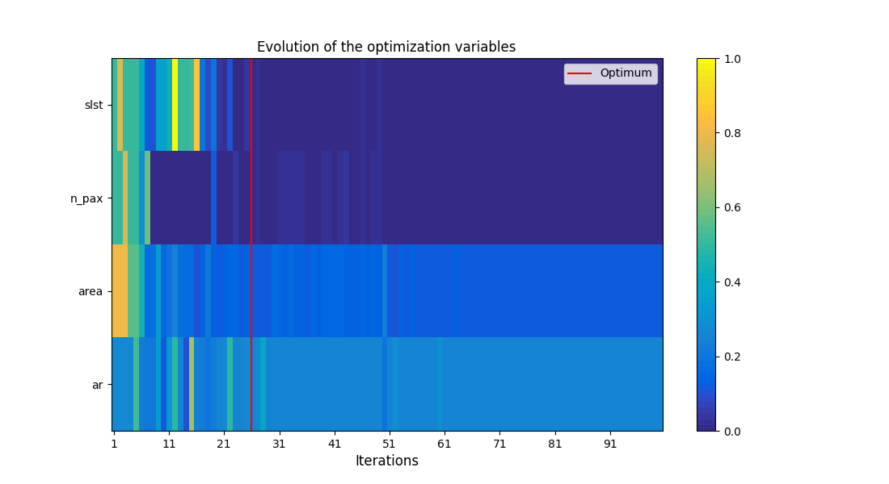
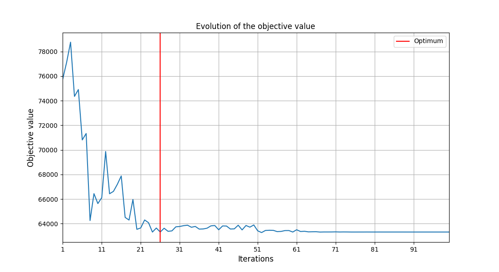

#### 📈 Analyse de la convergence sur le modèle réel
* **Évolution des variables d'optimisation (`uc2_p1_optimum_var.png`)** : L'algorithme `NLOPT_COBYLA` fait converger la poussée moteur (`slst`) et le nombre de passagers (`n_pax`) directement vers leurs bornes inférieures respectives ($100\text{ kN}$ et $120$ passagers). C'est un comportement physique attendu : réduire la poussée et le nombre de passagers diminue directement la masse à vide et le carburant nécessaire, ce qui minimise la MTOM. La surface alaire (`area`) et l'allongement de l'aile (`ar`) convergent vers des valeurs intermédiaires ($111{,}58\text{ m}^2$ et $8{,}89$). Ce compromis géométrique permet de satisfaire les contraintes aérodynamiques et opérationnelles (vitesse d'approche et décollage) tout en évitant d'alourdir inutilement la structure de l'aile.
* **Évolution de la fonction objectif (`uc2_p1_objective_val.png`)** : La MTOM part d'environ $76\text{ tonnes}$ à l'état initial, augmente temporairement lors des premières itérations pour trouver un point faisable, puis décroît rapidement avec quelques oscillations avant de se stabiliser et d'atteindre son minimum de $63\,323{,}83\text{ kg}$ à l'itération $26$ (indiquée par la ligne rouge).
* **Évolution des contraintes (`uc2_p1_ineq_constraint.png`)** : Durant les premières itérations, plusieurs contraintes (comme l'envergure `span` et la distance de décollage `tofl`) sont violées (bandes rouges). L'optimiseur ajuste rapidement les variables pour ramener l'avion dans le domaine faisable (bandes vertes). À l'optimum, la contrainte de vitesse d'approche (`vapp`) et de vitesse verticale (`vz`) sont extrêmement proches de $0$ (couleur blanche/très claire), indiquant qu'elles sont actives et dimensionnantes.
* **Distance à l'optimum (`uc2_p1_optim_dist.png`)** : La distance au point optimal $\|x-x^*\|$ décroît globalement et atteint son minimum à l'itération $26$. Par la suite, l'optimiseur continue d'explorer l'espace local avec des pas de plus en plus fins (la distance descend sous $10^{-4}$), confirmant la convergence.

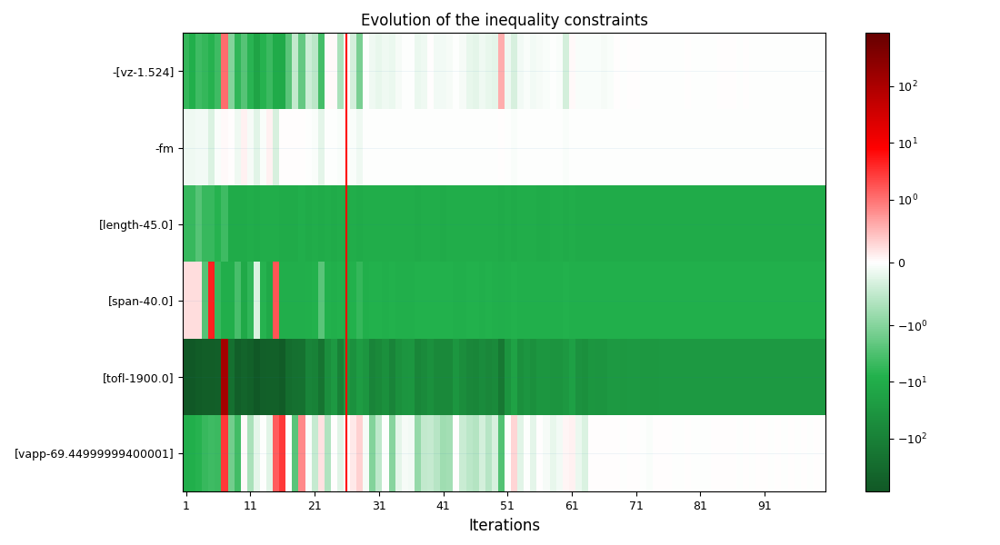
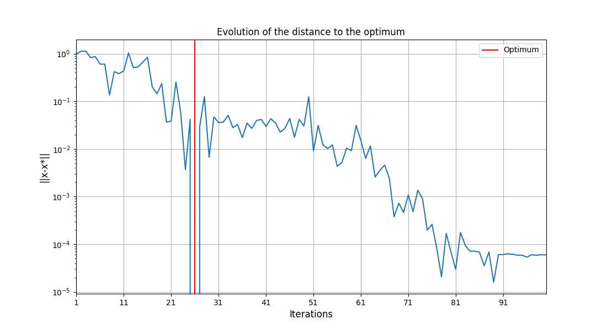

#### Variables de conception optimales (Design Space)

| Variable | Description | Borne Inf | Valeur Optimale | Borne Sup | Type | Statut |
| :--- | :--- | :---: | :---: | :---: | :---: | :---: |
| **`slst`** | Poussée maximale au niveau de la mer (N) | $100\,000$ | **$100\,000$** | $200\,000$ | float | **Active à la borne inf** |
| **`n_pax`** | Nombre de passagers | $120$ | **$120$** | $180$ | float | **Active à la borne inf** |
| **`area`** | Surface alaire ($\text{m}^2$) | $100$ | **$111{,}58$** | $200$ | float | Intermédiaire |
| **`ar`** | Allongement de l'aile | $5$ | **$8{,}89$** | $20$ | float | Intermédiaire |

## Surrogate

### Linear Regression

### Résultats d'optimisation internes sur métamodèle linéaire (Linear Surrogate Optimization)

* **Algorithme utilisé :** `NLOPT_COBYLA`
* **Statut :** Nombre maximal d'itérations atteint. GEMSEO a arrêté le pilote.
* **Faisabilité :** La solution est **faisable** selon le métamodèle (toutes les contraintes internes du surrogate sont respectées).
* **Objectif (MTOM) :** **$63\,153{,}78\text{ kg}$**

#### État des contraintes standardisées ($g(x) \le 0$) sur le métamodèle
Une valeur négative indique que la contrainte est satisfaite selon les approximations du modèle linéaire :

* **Vitesse verticale (`vz`) :** $-(\text{vz} - 1.524) = -2{,}22675$ *(Satisfaite avec marge)*
* **Marge de carburant (`fm`) :** $-\text{fm} = +6.68 \times 10^{-5}$ *(Active à la tolérance près)*
* **Longueur de l'avion (`length`) :** $\text{length} - 45.0 = -10{,}24989$ *(Satisfaite)*
* **Envergure (`span`) :** $\text{span} - 40.0 = -9{,}26248$ *(Satisfaite)*
* **Distance de décollage (`tofl`) :** $\text{tofl} - 1900.0 = -272{,}91245$ *(Satisfaite avec marge)*
* **Vitesse d'approche (`vapp`) :** $\text{vapp} - 69.45 = -8.39 \times 10^{-5}$ *(Active/Limite)*

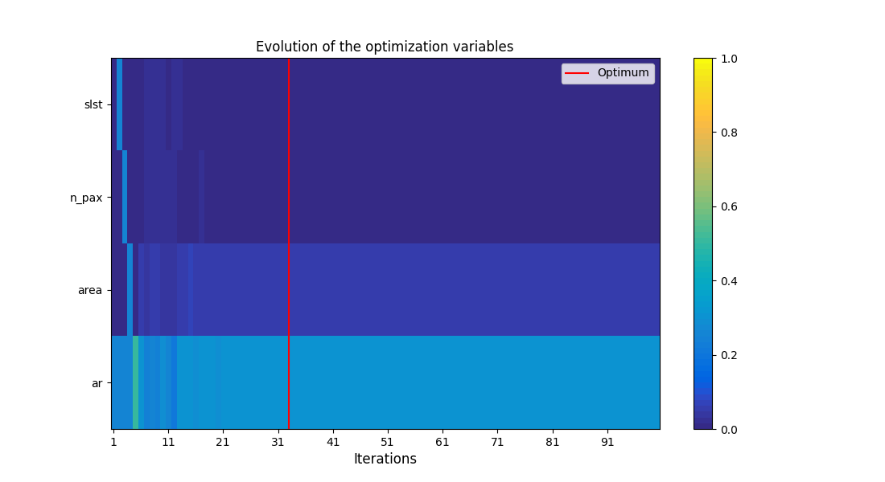
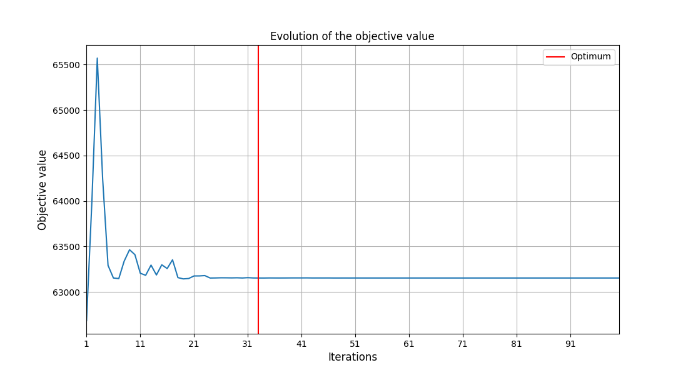

#### 📐 Variables de conception optimales (Design Space)

| Variable | Description | Borne Inf | Valeur Optimale | Borne Sup | Type | Statut |
| :--- | :--- | :---: | :---: | :---: | :---: | :---: |
| **`slst`** | Poussée maximale au niveau de la mer (N) | $100\,000$ | **$100\,000{,}46$** | $200\,000$ | float | **Active à la borne inf** |
| **`n_pax`** | Nombre de passagers | $120$ | **$120{,}00068$** | $180$ | float | **Active à la borne inf** |
| **`area`** | Surface alaire ($\text{m}^2$) | $100$ | **$105{,}47$** | $200$ | float | Intermédiaire |
| **`ar`** | Allongement de l'aile | $5$ | **$9{,}54$** | $20$ | float | Intermédiaire |

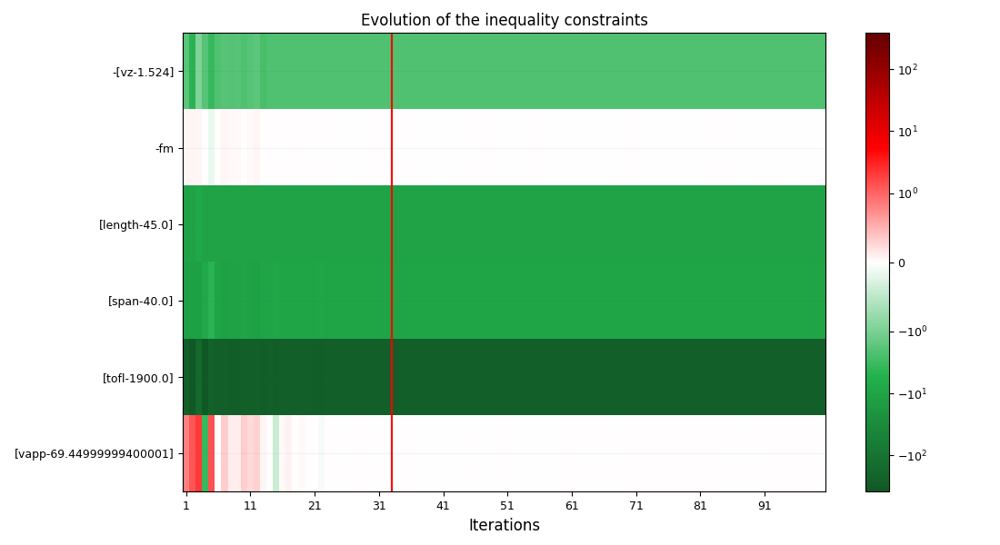
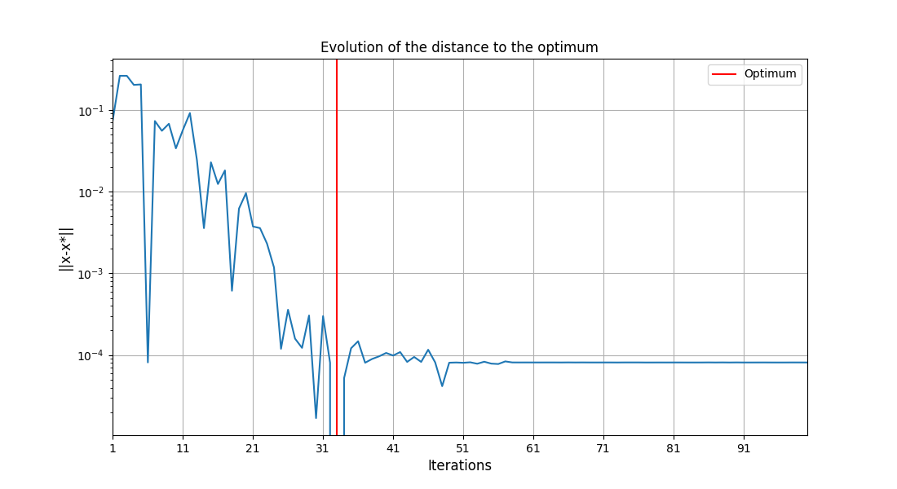

#### 📈 Analyse de l'optimisation sur métamodèle linéaire
* **Convergence interne (`uc2_p1_optimum_var_surr_Linear.png`, `uc2_p1_ineq_constraint_surr_Linear.png`)** : L'optimisation utilisant le métamodèle linéaire montre une convergence rapide. La poussée moteur (`slst`) et le nombre de passagers (`n_pax`) saturent de nouveau à leurs bornes inférieures. En revanche, le métamodèle linéaire conduit l'optimiseur vers une surface alaire plus faible ($105{,}47\text{ m}^2$ vs $111{,}58\text{ m}^2$) et un allongement plus grand ($9{,}54$ vs $8{,}89$) par rapport à l'optimisation sur modèle réel. Selon le métamodèle, cette configuration respecte toutes les contraintes, les plus actives étant la vitesse d'approche (`vapp`) et la marge de carburant (`fm`).
* **Objectif et distance (`uc2_p1_objective_val_surr_Linear.png`, `uc2_p1_optim_dist_surr_Linear.png`)** : La MTOM prédite converge vers $63\,153{,}78\text{ kg}$, soit environ $170\text{ kg}$ de moins que l'optimum réel. La distance à l'optimum décroît proprement, indiquant une convergence numérique idéale.

#### 🏁 Évaluation de l'optimum linéaire sur modèles réels (CustomDOE Evaluation)

* **Algorithme utilisé :** `CustomDOE`
* **Statut :** None
* **Message :** None
* **Faisabilité :** La solution réelle est **non faisable** (not feasible).
* **Objectif réel (MTOM) :** **$63\,018{,}36\text{ kg}$**

#### État des contraintes physiques réelles ($g(x) \le 0$)
Une valeur positive indique une contrainte **violée** :

* **Vitesse verticale (`vz`) :** $-(\text{vz} - 1.524) = -0{,}33572$ *(Satisfaite)*
* **Marge de carburant (`fm`) :** $-\text{fm} = -0{,}03580$ *(Satisfaite)*
* **Longueur de l'avion (`length`) :** $\text{length} - 45.0 = -10{,}24989$ *(Satisfaite)*
* **Envergure (`span`) :** $\text{span} - 40.0 = -8{,}28017$ *(Satisfaite)*
* **Distance de décollage (`tofl`) :** $\text{tofl} - 1900.0 = +56{,}68900$ *(**Violée de $56{,}69\text{ m}$** — distance réelle de $1956{,}69\text{ m}$)*
* **Vitesse d'approche (`vapp`) :** $\text{vapp} - 69.45 = +1{,}85935$ *(**Violée de $1{,}86\text{ m/s}$**, soit env. $3{,}6\text{ kt}$)*

#### ⚠️ Analyse de l'infaisabilité de l'optimum linéaire
* **Violations physiques (`uc2_p1_ineq_constraint_surr_Linear_xopt.png`)** : L'évaluation de l'optimum linéaire sur les véritables modèles physiques révèle que l'avion est en réalité non faisable. La distance de décollage réelle est de $1956{,}69\text{ m}$ (dépassant la limite de $1900\text{ m}$) et la vitesse d'approche réelle est de $71{,}31\text{ m/s}$ (dépassant la limite de $69{,}45\text{ m/s}$).
* **Explication physique** : Ces violations proviennent de l'incapacité du modèle de régression linéaire à représenter les non-linéarités complexes du modèle aérodynamique et de décollage. En modélisant ces contraintes par des plans linéaires, le métamodèle a sous-estimé l'augmentation de la distance de décollage et de la vitesse d'approche lorsque la surface alaire diminue. L'optimiseur a ainsi indûment profité de cette simplification pour réduire la surface alaire à $105{,}47\text{ m}^2$ afin de minimiser la masse, créant un avion trop petit pour pouvoir décoller ou atterrir en toute sécurité.

### RBF

### 🏁 Résultats d'optimisation sur métamodèle (Surrogate Optimization Result)

* **Algorithme utilisé :** `NLOPT_COBYLA`
* **Statut :** Successive iterates of the objective function are closer than ftol_rel or ftol_abs. GEMSEO a arrêté le pilote (convergence de la fonction objectif).
* **Faisabilité :** La solution trouvée est **faisable** (toutes les contraintes sont respectées aux tolérances près).
* **Objectif (MTOM) :** **$64\,859{,}40\text{ kg}$**

#### État des contraintes standardisées ($g(x) \le 0$)
Une valeur négative indique que la contrainte est satisfaite (plus elle est proche de 0, plus elle est active/limite) :

* **Vitesse verticale (`vz`) :** $-(\text{vz} - 1.524) = -1{,}31302$ *(Satisfaite avec marge)*
* **Marge de carburant (`fm`) :** $-\text{fm} = +5.14 \times 10^{-5}$ *(Active/Limite à la tolérance près)*
* **Longueur de l'avion (`length`) :** $\text{length} - 45.0 = -9{,}60922$ *(Satisfaite)*
* **Envergure (`span`) :** $\text{span} - 40.0 = -9{,}44244$ *(Satisfaite)*
* **Distance de décollage (`tofl`) :** $\text{tofl} - 1900.0 = -257{,}94731$ *(Satisfaite)*
* **Vitesse d'approche (`vapp`) :** $\text{vapp} - 69.45 = +9.78 \times 10^{-5}$ *(Active/Limite à la tolérance près)*

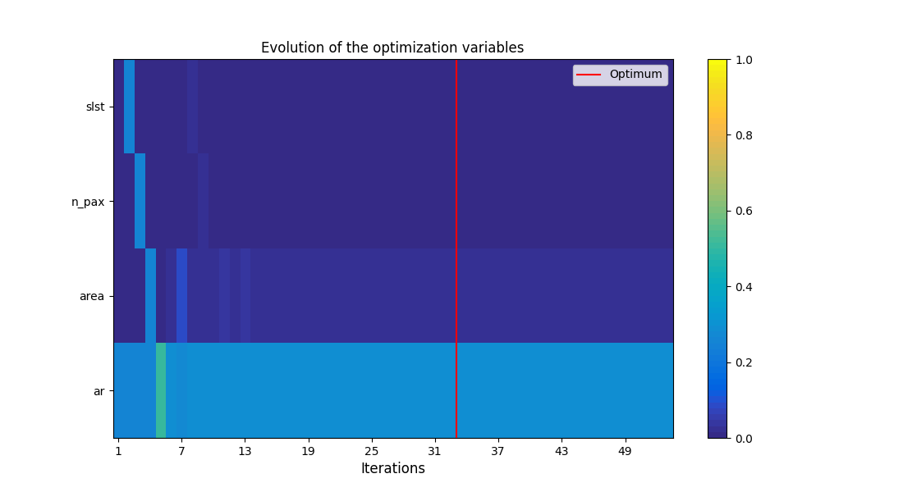
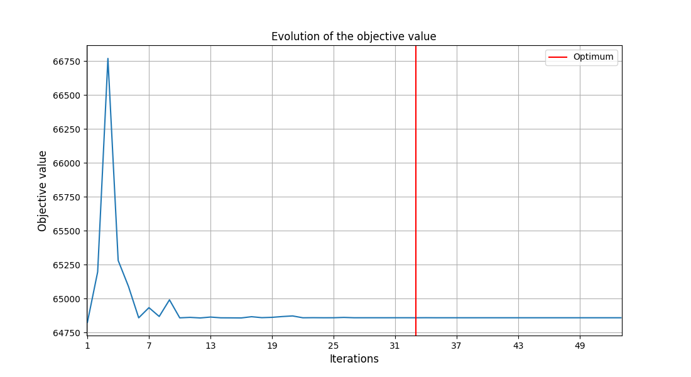

#### 📐 Variables de conception optimales (Design Space)

| Variable | Description | Borne Inf | Valeur Optimale | Borne Sup | Type | Statut |
| :--- | :--- | :---: | :---: | :---: | :---: | :--- |
| **`slst`** | Poussée maximale au niveau de la mer (N) | $100\,000$ | **$100\,000$** | $200\,000$ | float | **Active à la borne inf** |
| **`n_pax`** | Nombre de passagers | $120$ | **$120$** | $180$ | float | **Active à la borne inf** |
| **`area`** | Surface alaire ($\text{m}^2$) | $100$ | **$102{,}99$** | $200$ | float | Intermédiaire |
| **`ar`** | Allongement de l'aile | $5$ | **$9{,}40$** | $20$ | float | Intermédiaire |

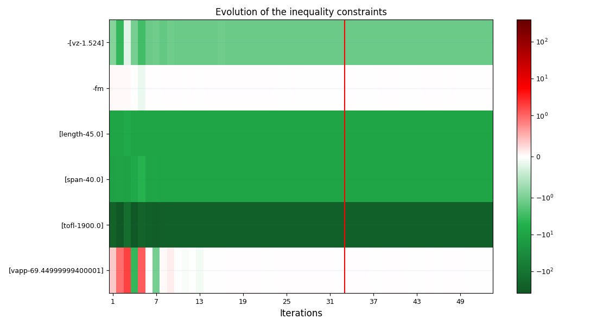
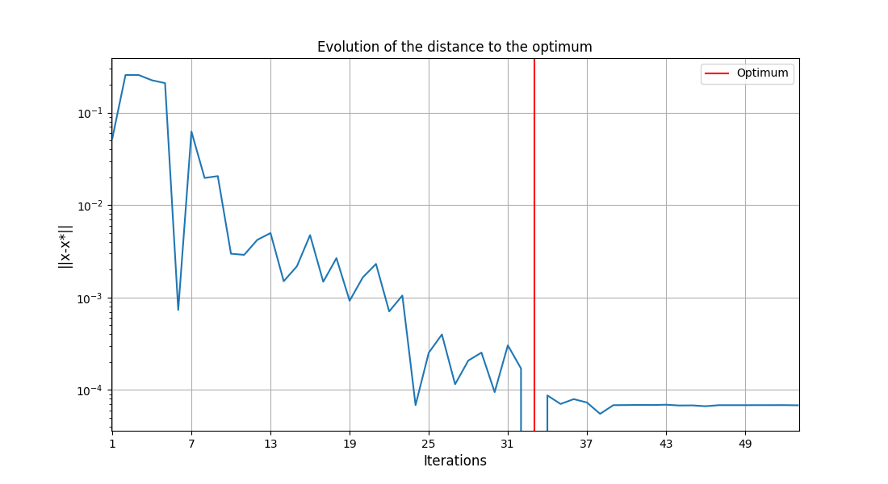

#### 📈 Analyse de l'optimisation sur métamodèle RBF
* **Convergence interne (`uc2_p1_optimum_var_surr_RBF.png`, `uc2_p1_ineq_constraint_surr_RBF.png`)** : Le comportement converge vers une poussée moteur (`slst`) et un nombre de passagers (`n_pax`) minimaux. La surface alaire (`area`) converge vers une valeur encore plus basse de $102{,}99\text{ m}^2$, et l'allongement à $9{,}40$. Le métamodèle RBF estime que cette solution respecte parfaitement toutes les contraintes, la vitesse d'approche (`vapp`) et la marge de carburant (`fm`) étant actives.
* **Objectif et distance (`uc2_p1_objective_val_surr_RBF.png`, `uc2_p1_optim_dist_surr_RBF.png`)** : La MTOM converge vers $64\,859{,}40\text{ kg}$ selon la prédiction RBF, et la distance à l'optimum s'annule proprement.

#### Faisabilité du résultat 
Not feasable

* **Algorithme utilisé :** `CustomDOE` (évaluation sur modèles réels de RBF)
* **Statut :** None (évaluation ponctuelle)
* **Faisabilité :** La solution finale est **non faisable** (not feasible) sur les vrais modèles physiques.
* **Objectif (MTOM) calculé :** **$62\,897{,}89\text{ kg}$** *(Masse sous-estimée de manière irréaliste par l'approximation RBF)*

#### État des contraintes réelles ($g(x) \le 0$)
Une valeur positive indique une contrainte **violée** :

* **Vitesse verticale (`vz`) :** $-(\text{vz} - 1.524) = -0{,}15839$ *(Satisfaite)*
* **Marge de carburant (`fm`) :** $-\text{fm} = -0{,}02128$ *(Satisfaite)*
* **Longueur de l'avion (`length`) :** $\text{length} - 45.0 = -10{,}25000$ *(Satisfaite)*
* **Envergure (`span`) :** $\text{span} - 40.0 = -8{,}88353$ *(Satisfaite)*
* **Distance de décollage (`tofl`) :** $\text{tofl} - 1900.0 = +94{,}13773$ *(**Violée de $94{,}14\text{ m}$** — distance réelle de $1994{,}14\text{ m}$)*
* **Vitesse d'approche (`vapp`) :** $\text{vapp} - 69.45 = +2{,}59279$ *(**Violée de $2{,}59\text{ m/s}$**, soit env. $5\text{ kt}$)*

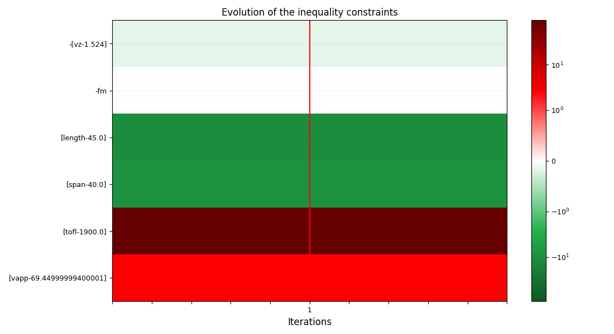

#### ⚠️ Analyse de l'exploitation du métamodèle RBF
* **Violations physiques (`uc2_p1_ineq_constraint_surr_RBF_xopt.png`)** : L'optimum du métamodèle RBF, lorsqu'il est projeté sur les véritables disciplines physiques, conduit à une infaisabilité sévère : le décollage (`tofl`) est dépassé de $+94{,}14\text{ m}$ et la vitesse d'approche (`vapp`) est dépassée de $+2{,}59\text{ m/s}$. La masse réelle mesurée ($62\,897{,}89\text{ kg}$) est bien plus basse que la MTOM prédite par la RBF ($64\,859{,}40\text{ kg}$), traduisant une forte sous-estimation.
* **Exploitation de l'erreur du modèle** : Ce phénomène est un exemple classique d'**exploitation du métamodèle (surrogate exploitation)**. L'optimiseur a découvert un point où l'approximation locale du métamodèle RBF sous-estimait les contraintes `tofl` et `vapp`. Dans un espace à 4 dimensions, un plan d'expérience (DoE) initial de seulement 30 échantillons (LHS) est extrêmement clairsemé. Les régions de transition et de limites de domaine sont mal définies, entraînant des erreurs d'interpolation importantes. Sans boucle de rétroaction (comme des itérations d'enrichissement de type EGO ou MGO), l'optimiseur tire parti de ces imperfections pour minimiser la MTOM, aboutissant à un design invalide en réalité.
