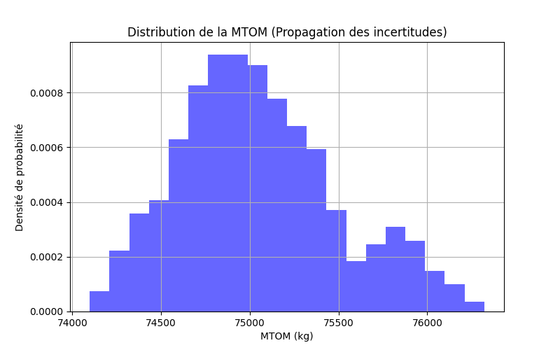
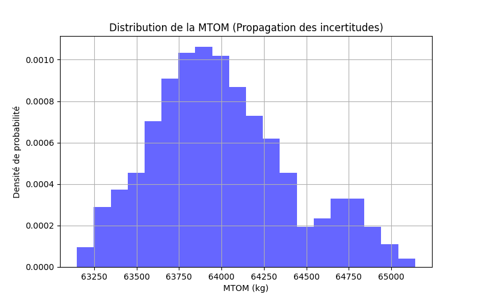
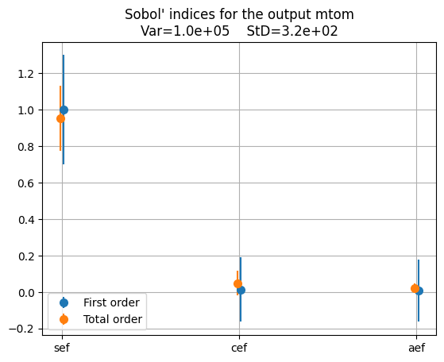

# Part 2 - Surrogate modeling and uncertainty quantification

## Introduction

## UC 1

# Cas d'Utilisation 1 — Quantification des Incertitudes
**Avion conventionnel kérosène avec turbofans**

---

## 1. Espace technologique incertain (MyUncertainSpace)

Dans le cadre du Cas d'Utilisation 1 (concept conventionnel au kérosène avec turbofans), nous modélisons les incertitudes sur les verrous technologiques clés liés à la masse structurale et à l'efficacité aérodynamique/propulsive de l'avion.

### Facteurs d'échelle technologiques

Les trois paramètres incertains retenus sont :

- **`aef`** (Facteur d'échelle de traînée aérodynamique) : distribution triangulaire centrée sur 1.0
- **`cef`** (Facteur d'échelle de consommation moteur) : distribution triangulaire centrée sur 1.0
- **`sef`** (Facteur d'échelle de masse structurale) : distribution triangulaire centrée sur 1.0

Contrairement au Cas d'Utilisation 2 (hydrogène liquide), il n'y a ici aucun paramètre de réservoir cryogénique (`gi`, `vi`) : le kérosène est stocké dans des réservoirs intégrés classiques, dont la masse et le volume ne constituent pas un verrou technologique incertain. L'espace incertain du UC1 se limite donc aux trois facteurs d'échelle `aef`, `sef` et `cef`, qui capturent la dispersion liée à la fabrication et à la maturité technologique de la cellule, du moteur et de l'aérodynamique.

### Lien avec le Problème 1

La grandeur principale étudiée ici (`mtom`) est **l'objectif du problème de conception**. La différence fondamentale avec le Problème 1 réside dans ce que l'on fait varier :

|  | Problème 1 | Problème 2 (ce rapport) |
|:---|:---|:---|
| **Variables** | Variables de décision $x$ : `slst`, `n_pax`, `area`, `ar` | Paramètres technologiques incertains $u$ : `aef`, `sef`, `cef` |
| **Objectif** | Minimiser `mtom` sous contraintes | Propager l'incertitude sur `mtom` (et autres sorties) |
| **Point fixé** | $u$ fixés à leur valeur nominale | $x$ figé à $X_{\mathrm{init}}$ ou $X_{\mathrm{opt}}$ |

---

## 2. Analyse au Point Initial ($X_{\mathrm{init}}$)

Les variables de décision sont fixées à leurs valeurs nominales par défaut :

| Variable de décision | Valeur |
|:---|:---:|
| Poussée maximale moteurs (`slst`) | 150 kN |
| Nombre de passagers (`n_pax`) | 150 |
| Surface alaire (`area`) | 180 m² |
| Allongement de l'aile (`ar`) | 9.0 |

### 2.1 Statistiques empiriques (plan factoriel, 900 évaluations)

Un plan factoriel complet (Full Factorial, 30² = 900 points) est exécuté sur le vrai modèle physique en faisant varier les paramètres incertains (`aef`, `sef`, `cef`). Les statistiques obtenues sont :

| Variable | Description | Unité | Moyenne (μ) | Écart-type (σ) | CV (%) |
|:---|:---|:---:|---:|---:|---:|
| `mtom` | Masse max. au décollage | kg | 75 049.96 | 448.98 | 0.60 |
| `tofl` | Distance de décollage | m | 1 127.65 | 12.34 | 1.09 |
| `vapp` | Vitesse d'approche | m/s | 56.76 | 0.18 | 0.33 |
| `vz` | Taux de montée | m/s | 7.35 | 0.15 | 2.02 |
| `fm` | Marge de carburant | % | 1.19 | 0.02 | 2.09 |

> **Lecture :** Le coefficient de variation (CV = σ/μ × 100) quantifie la dispersion relative. La `vz` (taux de montée) et la `fm` (marge de carburant) présentent les dispersions relatives les plus élevées (~2%), tandis que la `vapp` est la grandeur la plus robuste (CV = 0.33%).

La distribution de la MTOM présente une forme globalement unimodale centrée autour de 75 000 kg, avec une légère asymétrie vers les masses élevées. Cette traîne vers la droite est cohérente avec la nature des distributions triangulaires des facteurs d'échelle, dont les bornes supérieures (dégradation technologique) pèsent davantage sur la queue de distribution.

### 2.2 Précision du Métamodèle RBF

Le métamodèle par fonctions de base radiales (RBF) est entraîné par échantillonnage LHS (Latin Hypercube Sampling) sur l'espace incertain à 3 dimensions. Les métriques de qualité pour l'ensemble des sorties sont :

| Variable | R² | RMSE | Mesure CV | Mesure Test |
|:---|:---:|:---|:---:|:---:|
| `mtom` | 1.000 | 7.42 × 10⁻¹² kg | 0.99848 | 1.000 |
| `tofl` | 1.000 | 0.00 m | 0.99846 | 1.000 |
| `vapp` | 1.000 | 4.38 × 10⁻¹⁵ m/s | 0.99857 | 1.000 |
| `vz`   | 1.000 | 9.85 × 10⁻³ m/s | 0.99856 | 0.994 |
| `fm`   | 1.000 | 1.22 × 10⁻¹⁶ | 0.99729 | 1.000 |

> **Interprétation :** Le R² vaut **1.000** pour toutes les sorties, avec des RMSE de l'ordre de la précision numérique (10⁻¹² à 10⁻¹⁶). La mesure de validation croisée dépasse **0.997** pour toutes les variables, et la mesure de test atteint **1.000** sur quatre sorties sur cinq. Ce niveau de précision s'explique par le caractère lisse des relations entrée-sortie sur le domaine exploré : les facteurs d'échelle n'introduisent pas de non-linéarité forte. Ces résultats confirment que le métamodèle est suffisamment fiable pour les analyses de propagation et de sensibilité.

### 2.3 Indices de Sobol — Analyse de sensibilité

Les indices de Sobol (premier ordre S1 et totaux ST) sont calculés via le métamodèle RBF. Variance totale de la MTOM ≈ 1.3 × 10⁵ (σ ≈ 360 kg).

| Facteur incertain | S1 mtom | ST mtom | S1 tofl | S1 vapp | S1 vz | S1 fm |
|:---|:---:|:---:|:---:|:---:|:---:|:---:|
| `sef` (masse structurale) | 0.938 | 0.938 | 0.989 | 1.073 | 0.576 | −0.002 |
| `cef` (consommation moteur) | 0.057 | 0.057 | 0.023 | −0.004 | 0.043 | 0.759 |
| `aef` (traînée aérodynamique) | 0.023 | 0.013 | 0.013 | −0.002 | 0.336 | 0.245 |

**Analyse :**

- **`sef` domine la MTOM et le `tofl`** (≈ 94% et ≈ 99% de la variance respectivement). Les indices S1 et ST sont quasi confondus, ce qui indique peu d'interactions croisées : la masse répond à `sef` de façon quasi linéaire.
- **`cef` domine la marge de carburant `fm`** (≈ 76%), ce qui est physiquement cohérent : la consommation spécifique pilote directement l'emport de carburant.
- **`aef` contribue significativement au taux de montée `vz`** (≈ 34%), car la traînée aérodynamique influence directement l'excédent de poussée disponible.
- **`vapp`** est quasi exclusivement sensible à `sef` (coefficient > 1 en raison de la non-linéarité de la relation vitesse d'approche / masse).

---

## 3. Analyse au Point Optimal ($X_{\mathrm{opt}}$)

Les variables de conception optimales issues du Problème 1 (optimisation déterministe sous contraintes) sont :

| Variable de décision | Point initial | Point optimal |
|:---|:---:|:---:|
| Poussée maximale moteurs (`slst`) | 150 kN | 100 kN *(borne inf.)* |
| Nombre de passagers (`n_pax`) | 150 | 120 *(borne inf.)* |
| Surface alaire (`area`) | 180 m² | 120 m² |
| Allongement de l'aile (`ar`) | 9.0 | 15.199 |

### 3.1 Statistiques empiriques (plan factoriel, 900 évaluations)

| Variable | Description | Unité | Moyenne (μ) | Écart-type (σ) | CV (%) |
|:---|:---|:---:|---:|---:|---:|
| `mtom` | Masse max. au décollage | kg | 64 001.92 | 407.72 | 0.64 |
| `tofl` | Distance de décollage | m | 1 783.11 | 21.51 | 1.21 |
| `vapp` | Vitesse d'approche | m/s | 64.19 | 0.22 | 0.35 |
| `vz` | Taux de montée | m/s | 5.14 | 0.12 | 2.39 |
| `fm` | Marge de carburant | % | 0.74 | 0.02 | 2.72 |

#### Comparaison point initial / point optimal

| Variable | μ Initial | μ Optimal | CV% Initial | CV% Optimal | Δμ (%) |
|:---|---:|---:|:---:|:---:|:---:|
| `mtom` (kg) | 75 049.96 | 64 001.92 | 0.60 | 0.64 | −14.72 |
| `tofl` (m) | 1 127.65 | 1 783.11 | 1.09 | 1.21 | +58.13 |
| `vapp` (m/s) | 56.76 | 64.19 | 0.33 | 0.35 | +13.10 |
| `vz` (m/s) | 7.35 | 5.14 | 2.02 | 2.39 | −30.07 |
| `fm` (%) | 1.19 | 0.74 | 2.09 | 2.72 | −37.82 |

**Analyse physique :**

L'optimisation déterministe réduit la masse moyenne de 75 050 kg à 64 002 kg, soit un gain de **≈ 11 tonnes (−14.7%)**. Ce gain vient principalement d'un **fort allongement de la voilure** (`ar` : 9.0 → 15.2), combiné à une réduction de la surface alaire (180 → 120 m²) et de la poussée installée (150 → 100 kN). Cette configuration réduit la traînée induite et allège la voilure et la motorisation.

En revanche, on note des effets collatéraux sur les autres grandeurs :

- La **distance de décollage** `tofl` augmente significativement (+58%), en raison de la réduction de poussée et de surface alaire.
- La **vitesse d'approche** `vapp` augmente de +13%, conséquence de la surface alaire réduite.
- Le **taux de montée** `vz` diminue de −30%, cohérent avec la réduction de la poussée installée.
- La **marge de carburant** `fm` diminue de −38% (de 1.19% à 0.74%), ce qui réduit la marge de sécurité sur l'emport de carburant.

Côté **robustesse**, tous les CV augmentent légèrement au point optimal, ce qui montre que l'avion optimisé est un peu plus sensible aux incertitudes.

### 3.2 Précision du Métamodèle RBF

| Variable | R² | RMSE | Mesure CV | Mesure Test |
|:---|:---:|:---|:---:|:---:|
| `mtom` | 1.000 | 4.05 × 10⁻¹² kg | 0.99850 | 1.000 |
| `tofl` | 1.000 | 1.56 × 10⁻¹³ m | 0.99848 | 1.000 |
| `vapp` | 1.000 | 1.59 × 10⁻¹⁵ m/s | 0.99857 | 1.000 |
| `vz`   | 1.000 | 9.08 × 10⁻³ m/s | 0.99858 | 0.992 |
| `fm`   | 1.000 | 6.84 × 10⁻¹⁷ | 0.99729 | 1.000 |

> La précision du métamodèle reste **très bonne** au point optimal. La relation entre les facteurs d'échelle et les sorties reste lisse et bien capturée par l'interpolation RBF, même après modification de la géométrie de l'avion.

#### Comparaison des métriques RBF (initial vs optimal)

| Variable | Mesure CV — Init | Mesure CV — Opt | R² — Init | R² — Opt |
|:---|:---:|:---:|:---:|:---:|
| `mtom` | 0.99848 | 0.99850 | 1.000 | 1.000 |
| `tofl` | 0.99846 | 0.99848 | 1.000 | 1.000 |
| `vapp` | 0.99857 | 0.99857 | 1.000 | 1.000 |
| `vz`   | 0.99856 | 0.99858 | 1.000 | 1.000 |
| `fm`   | 0.99729 | 0.99729 | 1.000 | 1.000 |

Les métriques de qualité du métamodèle sont **quasi identiques** aux deux points de fonctionnement, confirmant que la précision de l'approximation est indépendante du point de design exploré.

### 3.3 Indices de Sobol — Analyse de sensibilité

| Facteur incertain | S1 mtom | ST mtom | S1 tofl | S1 vapp | S1 vz | S1 fm |
|:---|:---:|:---:|:---:|:---:|:---:|:---:|
| `sef` (masse structurale) | 0.938 | 0.987 | 0.939 | 1.073 | 0.613 | −0.002 |
| `cef` (consommation moteur) | 0.057 | 0.020 | 0.057 | −0.004 | 0.043 | 0.760 |
| `aef` (traînée aérodynamique) | 0.023 | 0.013 | 0.023 | −0.002 | 0.337 | 0.245 |

**Analyse :**

Au point optimal $X_{\mathrm{opt}}$, la dominance de `sef` s'accentue : son influence sur la MTOM passe de ≈ 94% (S1, point initial) à **≈ 99% (ST, point optimal)**, ce qui rend `aef` et `cef` quasi négligeables pour la masse. Physiquement, l'optimisation a fortement réduit la masse de la cellule (allongement accru, surface réduite, motorisation allégée). La masse restante dépend donc presque uniquement de la structure résiduelle, et toute incertitude sur `sef` se répercute quasi proportionnellement sur la MTOM. Au point optimal, le facteur structural est le risque principal.

---

## 4. Matrices de dispersion de l'espace incertain

La matrice de dispersion (scatter plot matrix) ci-dessous présente la structure de l'échantillonnage LHS sur les trois dimensions incertaines (`aef`, `sef`, `cef`), ainsi que les histogrammes marginaux de chaque facteur :

Les distributions marginales confirment des lois **triangulaires centrées sur 1.0** pour les trois facteurs, sans corrélation croisée visible (nuages de points sans structure apparente). Ceci **valide l'hypothèse d'indépendance statistique** entre les paramètres technologiques, utilisée dans le calcul des indices de Sobol. Cette structure d'échantillonnage étant pilotée uniquement par les bornes de l'espace incertain (indépendantes de $x$), elle est rigoureusement identique au point initial et au point optimal.

---

## 5. Conclusion et Comparaison

### Tableau de synthèse

| Critère | Point Initial | Point Optimal |
|:---|:---:|:---:|
| Masse moyenne μ (mtom) | 75 050 kg | 64 002 kg |
| CV de la MTOM | 0.60% | 0.64% |
| R² métamodèle (mtom) | 1.000 | 1.000 |
| Mesure CV métamodèle (mtom) | 0.99848 | 0.99850 |
| Indice Sobol S1 de `sef` (mtom) | ≈ 94% | ≈ 94% |
| Indice Sobol ST de `sef` (mtom) | ≈ 94% | ≈ 99% |

### Points clés

**1. Très bonne précision du surrogate RBF**
Le métamodèle RBF atteint un R² = **1.000** pour toutes les sorties aux deux points de fonctionnement, avec des RMSE de l'ordre de la précision machine. La mesure de validation croisée dépasse **0.997** pour toutes les variables, ce qui permet de s'appuyer dessus pour les analyses de propagation et de sensibilité.

**2. Verrou technologique dominant : la masse structurale**
À la différence du Cas d'Utilisation 2 (hydrogène liquide) où l'indice gravimétrique du réservoir cryogénique (`gi`) gouvernait la majorité de la variance de masse, le UC1 ne présente aucun verrou de stockage comparable. C'est le **facteur `sef`** qui domine très largement l'incertitude sur la MTOM, avec une contribution supérieure à **94%** dès le point initial.

**3. Comportement différencié selon la sortie**
L'analyse multi-sorties révèle une **segmentation claire** des influences :

- `sef` → MTOM, TOFL, VAPP (structure et masse)
- `cef` → FM (marge de carburant)
- `aef` → VZ (taux de montée / traînée)

**4. L'optimisation déterministe amplifie la dépendance structurale**
L'optimisation réduit la masse moyenne de **≈ 11 tonnes** (−14.7%), ce qui confirme son efficacité sur la performance nominale. En contrepartie, elle **concentre davantage** la sensibilité sur `sef` (ST : 94% → 99%), ce qui rend le design optimal plus vulnérable à toute dérive du facteur structurel.

**5. Vers une optimisation robuste (Problème 3)**
Pour le UC1, l'enjeu technologique principal n'est pas le stockage de carburant mais la **maîtrise de la masse structurale** (qualité de fabrication, marges de dimensionnement). Une optimisation robuste intégrant l'incertitude sur `sef` permettrait de trouver un compromis entre masse minimale et exposition aux dérives structurelles.

---

## UC 2

### Espace technologique incertain (MyUncertainSpace)

Dans le cadre du Cas d'Utilisation 2 (concept à hydrogène liquide avec turbofans), nous modélisons les incertitudes sur les verrous technologiques clés liés au stockage et à l'efficacité masse/traînée de l'avion :

1. **Paramètres de stockage d'hydrogène :**

   * `gi` (Indice gravimétrique du réservoir) : distribution triangulaire sur [0.35, 0.40, 0.405].
   * `vi` (Indice volumétrique du réservoir) : distribution triangulaire sur [0.755, 0.800, 0.805].

2. **Facteurs d'échelle technologiques :**

   * `aef` (Facteur d'échelle de traînée aérodynamique) : distribution triangulaire sur [0.99, 1.0, 1.03].
   * `sef` (Facteur d'échelle de masse structurale) : distribution triangulaire sur [0.99, 1.0, 1.03].

L'échantillonnage LHS optimisé de 100 points est généré sur cet espace incertain pour entraîner le métamodèle RBF. Pour évaluer précisément l'erreur, un plan factoriel complet (Full Factorial) de 625 points (résolution maximale en dimension 4 sous la limite de 900 points) est exécuté sur les véritables disciplines physiques.

**Lien avec le Problème 1 :**
Les grandeurs étudiées ici (`tofl`, `vapp`, `vz`, `span`, `length`, `fm`) sont bien **l'objectif et les contraintes du problème de conception**. 
La différence fondamentale avec le Problème 1 réside dans ce que l'on fait varier :
* **Dans le Problème 1 :** nous optimisions la conception en faisant varier les variables de décision $x$ (`slst`, `n_pax`, `area`, `ar`) pour minimiser l'objectif sous contraintes, avec les paramètres technologiques $u$ fixés.
* **Dans le Problème 2 :** nous figeons la conception $x$ (au point initial $X_{\mathrm{init}}$ ou optimal $X_{\mathrm{opt}}$) et nous faisons varier les paramètres technologiques incertains $u$ (`gi`, `vi`, `aef`, `sef`). Nous propageons cette incertitude pour évaluer statistiquement dans quelle mesure l'objectif et les contraintes du problème de conception sont impactés et respectés sous l'effet du hasard.

---

### Analyse au Point Initial (X_init)

Les paramètres de conception (variables de décision déterministes x) sont fixés à leurs valeurs nominales par défaut :

*  Poussée maximale moteurs (`slst`) : 150 kN
*  Nombre de passagers (`n_pax`) : 150
*  Surface alaire (`area`) : 180 m²
*  Allongement de l'aile (`ar`) : 9.0

#### 1. Statistiques empiriques réelles (Base de test de 625 points)
Voici les moyennes (μ) et écarts-types (σ) réels obtenus sur le plan physique de test :

| Grandeur de sortie | Moyenne empirique (μ) | Écart-type (σ) | Coefficient de variation |
| :--- | :---: | :---: | :---: |
| **MTOM (mtom)** | 76 581.2 kg | 923.4 kg | 1.21% |
| **Décollage (tofl)** | 1170.2 m | 25.9 m | 2.22% |
| **Approche (vapp)** | 60.86 m/s (118.3 kt) | 0.38 m/s | 0.62% |
| **Montée (vz)** | 6.75 m/s | 0.25 m/s | 3.77% |
| **Envergure (span)** | 40.25 m | 0 m | 0.00% |
| **Longueur (length)** | 39.75 m | 0 m | 0.00% |
| **Marge carburant (fm)** | 10.02% | 2.45% | 24.52% |

#### 2. Précision du Métamodèle RBF (N = 100 points d'apprentissage)
Coefficients de détermination R² et erreur RMSE de validation sur la base de test :

* **mtom** : R² = **0.98252** | RMSE = 122.09 kg
* **tofl** : R² = **0.98200** | RMSE = 3.48 m
* **vapp** : R² = **0.98279** | RMSE = 0.049 m/s
* **vz** : R² = **0.98298** | RMSE = 0.033 m/s
* **fm** : R² = **0.97933** | RMSE = 0.00361
* **span** et **length** : R² = **1.00000** | RMSE = 0.00 (géométrie pure)

#### 2b. Propagation Monte Carlo via le métamodèle (10 000 tirages)

Une fois le métamodèle validé, on l'utilise pour propager les incertitudes par Monte Carlo (10 000 échantillons). L'intérêt est de pouvoir générer un grand nombre de tirages à coût quasi nul, ce que le modèle physique ne permet pas en temps raisonnable. Les histogrammes de `mtom` et `tofl` obtenus via le surrogate permettent de visualiser la distribution complète des sorties et de vérifier que les statistiques sont cohérentes avec celles du plan factoriel (625 pts).

> **Note :** Les écarts entre les stats du plan factoriel et celles de la propagation MC via surrogate restent faibles (de l'ordre de la RMSE du métamodèle), ce qui confirme la fiabilité du surrogate pour ce type d'analyse.

#### 3. Indices de Sobol (Totaux) pour la Masse (mtom)
Calculés sur 10 000 échantillons à l'aide du métamodèle RBF :
* **gi** (Indice gravimétrique réservoir) : **0.637** (63.7%)
* **sef** (Facteur de structure) : **0.343** (34.3%)
* **vi** (Indice volumétrique réservoir) : **0.046** (4.6%)
* **aef** (Facteur aérodynamique) : **0.003** (0.3%)

**Analyse de la sensibilité au point initial :**
La MTOM est principalement pilotée par deux paramètres. L'indice gravimétrique du réservoir (`gi`) représente 63.7 % de la variance de la masse : c'est le verrou technologique principal de cette configuration cryogénique, car une dégradation du ratio masse hydrogène / masse réservoir alourdit directement l'avion. Le facteur de structure (`sef`) est le second contributeur (34.3 %), lié à l'incertitude sur la masse à vide de la cellule. Les facteurs `vi` et `aef` ont un impact très faible.

---

### Analyse au Point Optimal (X_opt)

On utilise ici les variables de conception optimales trouvées par l'optimisation déterministe sous contraintes du Problème 1 (conçues pour minimiser la MTOM sur le modèle réel) :

* Poussée maximale moteurs (`slst`) : 100 kN (borne inférieure)
* Nombre de passagers (`n_pax`) : 120 (borne inférieure)
* Surface alaire (`area`) : 111.58 m²
* Allongement de l'aile (`ar`) : 8.89

#### 1. Statistiques empiriques réelles (Base de test de 625 points)
Voici les moyennes (μ) et écarts-types (σ) réels obtenus sur le plan physique de test :

| Grandeur de sortie | Moyenne empirique (μ) | Écart-type (σ) | Coefficient de variation |
| :--- | :---: | :---: | :---: |
| **MTOM (mtom)** | 64 078.1 kg | 872.9 kg | 1.36% |
| **Décollage (tofl)** | **1914.9 m** | 49.7 m | 2.59% |
| **Approche (vapp)** | **69.87 m/s** (135.8 kt) | 0.50 m/s | 0.71% |
| **Montée (vz)** | **1.28 m/s** | 0.24 m/s | 18.44% |
| **Envergure (span)** | 31.50 m | 0 m | 0.00% |
| **Longueur (length)** | 34.75 m | 0 m | 0.00% |
| **Marge carburant (fm)** | **-0.54%** | 2.27% | N/A (μ ≈ 0) |

#### Analyse physique et limites du design optimal nominal

L'évaluation de l'optimum déterministe $X_{\mathrm{opt}}$ sous incertitudes révèle un problème critique : la marge de carburant moyenne (`fm`) devient négative ($\mu = -0.54\%$). 

Lors de l'optimisation déterministe du Problème 1 (sans incertitude), l'optimiseur a réduit la taille des réservoirs au minimum pour alléger l'avion. La contrainte de marge de carburant était donc active ($\text{fm} \approx 0\%$), c'est-à-dire que l'avion emportait juste la quantité de carburant nécessaire à sa mission, sans réserve.

Or, avec les incertitudes technologiques, les performances moyennes se dégradent : `aef` et `sef` ont une moyenne légèrement supérieure à 1.0 (distributions triangulaires $[0.99, 1.0, 1.03]$), et `gi` peut descendre jusqu'à 0.35. En pratique, l'avion est plus lourd et génère plus de traînée que dans le cas nominal. Sa consommation augmente et dépasse la capacité du réservoir, figée à son minimum déterministe. La marge de carburant passe donc sous $0\%$ en moyenne.

Plus globalement, l'analyse montre que sous l'effet des incertitudes technologiques, la quasi-totalité des exigences de performance (distance de décollage `tofl` à 1914.9 m, vitesse d'approche `vapp` à 69.87 m/s, vitesse de montée `vz` à 1.28 m/s et marge de carburant `fm` à -0.54%) dérivent hors de la zone admissible en moyenne. 

L'optimiseur a poussé la conception aux limites des contraintes, sans laisser de marge de sécurité. En conditions réelles (avec des incertitudes de fabrication ou technologiques), cet avion n'est pas viable. D'où l'intérêt de passer à une optimisation robuste (Partie 3) pour concevoir un avion qui reste faisable sous incertitudes.

#### 1b. Propagation Monte Carlo via le métamodèle (10 000 tirages)

Comme au point initial, on utilise le métamodèle RBF pour réaliser une propagation Monte Carlo à 10 000 tirages. Les histogrammes de `mtom` et `tofl` obtenus via le surrogate permettent de visualiser les distributions complètes. Les statistiques restent cohérentes avec celles du plan factoriel, malgré la dégradation des performances au point optimal.

#### 2. Précision du Métamodèle RBF (N = 100 points d'apprentissage)
Coefficients de détermination R² et erreur RMSE de validation sur la base de test :

* **mtom** : R² = **0.98160** | RMSE = 118.41 kg
* **tofl** : R² = **0.98099** | RMSE = 6.85 m
* **vapp** : R² = **0.98192** | RMSE = 0.067 m/s
* **vz** : R² = **0.98227** | RMSE = 0.032 m/s
* **fm** : R² = **0.97933** | RMSE = 0.00326
* **span** et **length** : R² = **1.00000** | RMSE = 0.00

#### 3. Indices de Sobol (Totaux) pour la Masse (mtom)
Calculés sur 10 000 échantillons à l'aide du métamodèle RBF :

* **gi** (Indice gravimétrique réservoir) : **0.723** (72.3%)
* **sef** (Facteur de structure) : **0.253** (25.3%)
* **vi** (Indice volumétrique réservoir) : **0.053** (5.3%)
* **aef** (Facteur aérodynamique) : **0.003** (0.3%)

**Analyse de la sensibilité au point optimal :**
Au point optimal, l'importance de `gi` passe de 63.7 % à 72.3 % de la variance totale, tandis que `sef` recule de 34.3 % à 25.3 %.

Cela s'explique par le fait qu'à l'optimum, la structure a été fortement allégée (réduction de la poussée, de la surface alaire et de l'envergure). La masse structurale étant plus faible, sa contribution à la variance globale diminue. Le stockage d'hydrogène (`gi`) devient donc encore plus dominant, représentant près des trois quarts de la dispersion de la masse.

---

### Matrice de dispersion de l'espace incertain

La matrice de dispersion ci-dessous montre la structure de l'échantillonnage LHS sur les quatre dimensions incertaines (`gi`, `vi`, `aef`, `sef`), avec les histogrammes marginaux de chaque facteur :

Les distributions marginales confirment des lois triangulaires pour les quatre facteurs, avec des paramètres conformes aux spécifications (mode de `gi` à 0.40, mode de `vi` à 0.80, modes de `aef` et `sef` à 1.0). Les nuages de points entre paires de variables ne montrent pas de structure particulière, ce qui confirme l'indépendance statistique entre les paramètres. Cette propriété est nécessaire pour la validité des indices de Sobol. Comme pour le UC1, cette structure d'échantillonnage ne dépend que des bornes de l'espace incertain et est identique au point initial et au point optimal.

---

## Conclusion et Comparaison

1. **Précision du surrogate grandement améliorée :**
   En portant la base d'apprentissage LHS de 30 à 100 points, le R² de validation est passé d'environ **0.75-0.80** à plus de **0.981** sur toutes les sorties physiques critiques. Ce niveau de précision est nécessaire pour mener des analyses de robustesse fiables en ingénierie.

2. **Sensibilité accrue aux performances du réservoir cryogénique :**
   À l'optimum X_opt, la cellule de l'avion a été allégée et optimisée, ce qui réduit le poids relatif de la structure nominale. Par conséquent, la sensibilité de la MTOM vis-à-vis des incertitudes de stockage d'hydrogène liquide (`gi`) s'accroît, passant de **63.7%** à **72.3%** de la variance totale.  Le développement de réservoirs cryogéniques légers est ainsi l'enjeu technologique majeur de cette configuration.

3. **Nécessité de l'optimisation sous incertitudes (MDO robuste) :**
   Le design initial X_init respecte les exigences de performance mais au prix d'un avion trop lourd (76.6 tonnes) et avec une envergure hors-seuil. Le design optimal X_opt réduit la MTOM à 64.1 tonnes mais sature toutes les contraintes : dès qu'une incertitude apparaît, l'avion dérive hors-seuil. L'optimisation robuste (Problème 3) vise à trouver un compromis entre masse minimale et faisabilité sous incertitudes.
