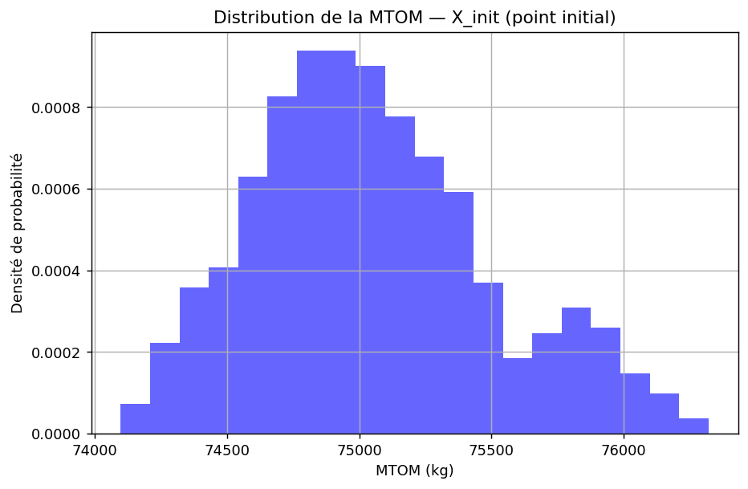
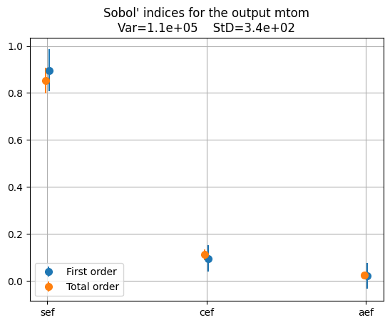
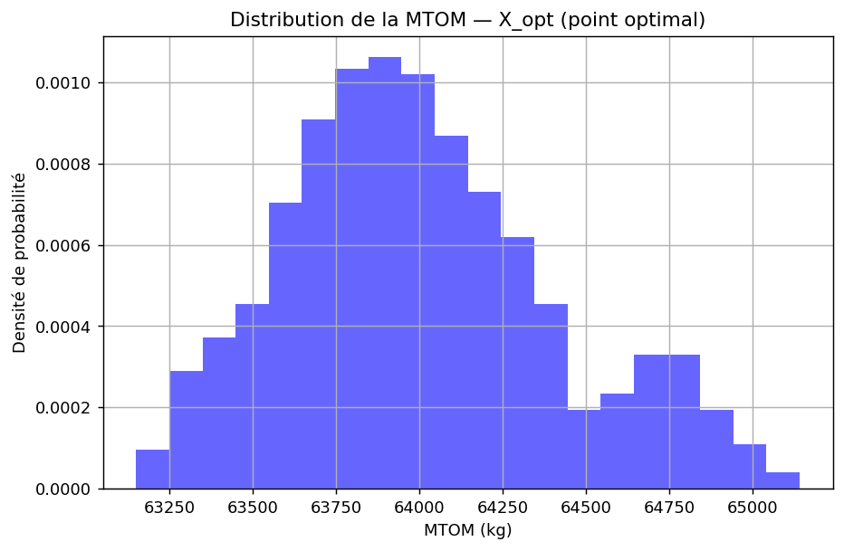
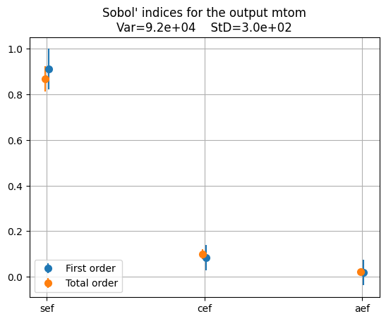
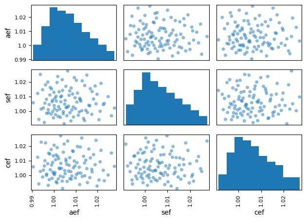
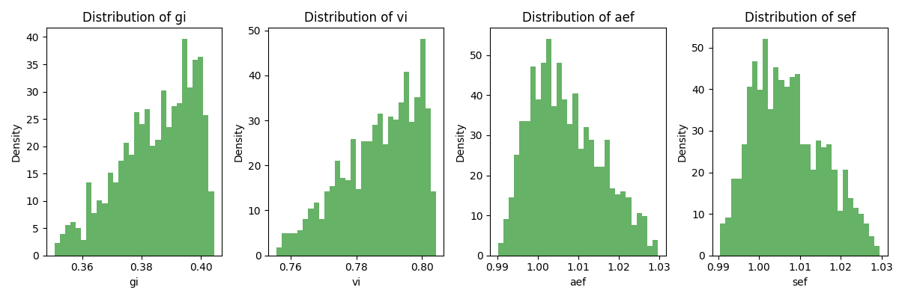
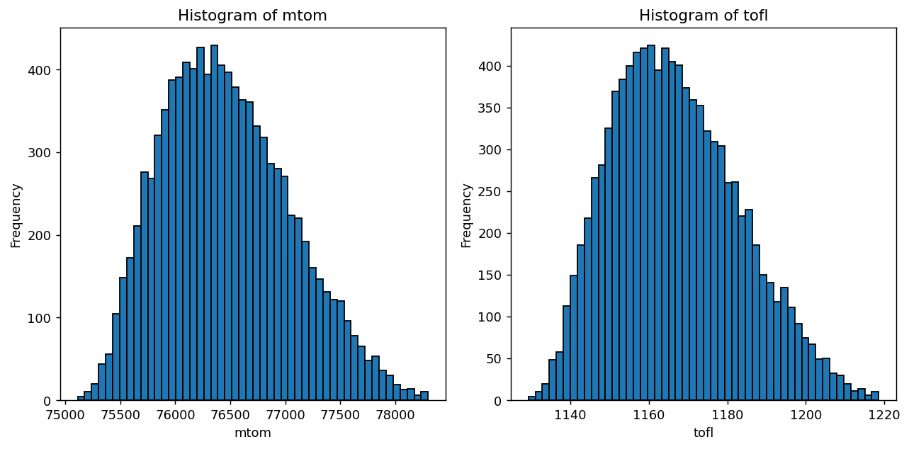
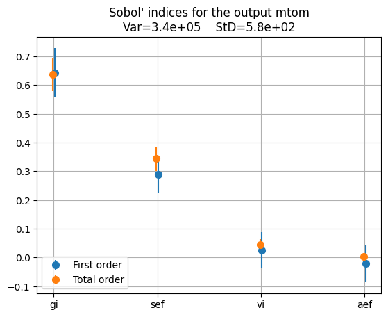
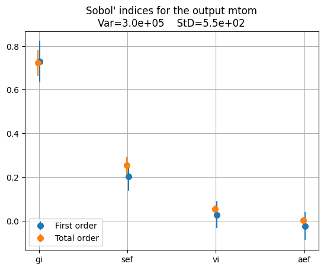
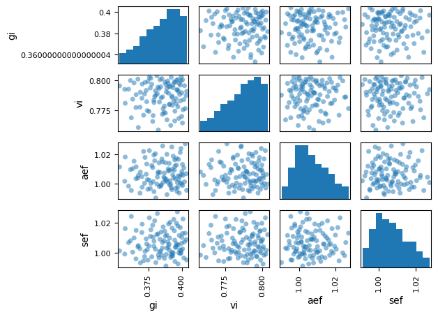

# Partie 2 — Modèle surrogate et quantification des incertitudes

## Introduction

Le Problème 2 fige la conception $x$ et étudie l'effet des incertitudes
technologiques $u$ sur les sorties. On construit un surrogate
$\hat{f}(u) = f(x_{\text{fixe}}, u)$, on le valide, puis on l'utilise pour
**propager** l'incertitude (statistiques empiriques, Monte-Carlo) et pour
**l'expliquer** par une analyse de sensibilité (indices de Sobol). L'analyse est
menée pour les deux cas d'usage, et pour chacun **à deux points de conception** :
le point initial $X_{\mathrm{init}}$ (valeurs par défaut) et le point optimal
$X_{\mathrm{opt}}$ issu de la Partie 1. Les espaces incertains diffèrent selon le cas d'usage : trois facteurs d'échelle (`aef`, `cef`, `sef`) pour le kérosène, auxquels
s'ajoutent les indices de réservoir cryogénique (`gi`, `vi`) pour l'hydrogène
liquide.

---

## Cas d'usage 1 — Kérosène / Turbofan

**Avion conventionnel kérosène avec turbofans.**

> **Note de formulation.** Toute la Partie 2 s'appuie sur la formulation étendue à
> 11 disciplines (incluant `operating_cost`), distincte du pipeline canonique `_oad.py`
> de la Partie 1. L'optimum $X_{\mathrm{opt}}$ utilisé plus bas y est donc recalculé
> sous cette formulation : ses valeurs de `area`/`ar` diffèrent de l'optimum
> canonique rapporté en Partie 1, sans changer les conclusions qualitatives.

### 1. Espace technologique incertain

Dans le cadre du UC1 (concept conventionnel au kérosène avec turbofans), nous modélisons les incertitudes sur les verrous technologiques clés liés à la masse structurale et à l'efficacité aérodynamique/propulsive de l'avion. Les trois paramètres incertains retenus sont :

- **`aef`** (facteur d'échelle de traînée aérodynamique) : distribution triangulaire centrée sur 1,0
- **`cef`** (facteur d'échelle de consommation moteur) : distribution triangulaire centrée sur 1,0
- **`sef`** (facteur d'échelle de masse structurale) : distribution triangulaire centrée sur 1,0

Contrairement au UC2 (hydrogène liquide), il n'y a ici aucun paramètre de réservoir cryogénique (`gi`, `vi`) : le kérosène est stocké dans des réservoirs intégrés classiques, dont la masse et le volume ne constituent pas un verrou technologique incertain. L'espace incertain du UC1 se limite donc aux trois facteurs d'échelle `aef`, `sef` et `cef`, qui capturent la dispersion liée à la fabrication et à la maturité technologique de la cellule, du moteur et de l'aérodynamique.

#### Lien avec le Problème 1

La grandeur principale étudiée ici (`mtom`) est **l'objectif du problème de conception**. La différence fondamentale avec le Problème 1 réside dans ce que l'on fait varier :

|  | Problème 1 | Problème 2 |
|:---|:---|:---|
| **Variables** | Variables de décision $x$ : `slst`, `n_pax`, `area`, `ar` | Paramètres technologiques incertains $u$ : `aef`, `sef`, `cef` |
| **Objectif** | Minimiser `mtom` sous contraintes | Propager l'incertitude sur `mtom` (et autres sorties) |
| **Point fixé** | $u$ fixés à leur valeur nominale | $x$ figé à $X_{\mathrm{init}}$ ou $X_{\mathrm{opt}}$ |

---

### 2. Analyse au Point Initial ($X_{\mathrm{init}}$)

Les variables de décision sont fixées à leurs valeurs nominales par défaut :

| Variable de décision | Valeur |
|:---|:---:|
| Poussée maximale moteurs (`slst`) | 150 kN |
| Nombre de passagers (`n_pax`) | 150 |
| Surface alaire (`area`) | 180 m$^{2}$ |
| Allongement de l'aile (`ar`) | 9,0 |

#### 2.1 Statistiques empiriques (plan factoriel, 729 points)

Un plan factoriel complet (Full Factorial, 9$^{3}$ = 729 points, soit 9 niveaux par facteur) est exécuté sur le vrai modèle physique en faisant varier les paramètres incertains (`aef`, `sef`, `cef`). Les statistiques obtenues sont :

| Variable | Description | Unité | Moyenne ($\mu$) | Écart-type ($\sigma$) | CV (%) |
|:---|:---|:---:|---:|---:|---:|
| `mtom` | Masse max. au décollage | kg | 75 049,96 | 448,98 | 0,60 |
| `tofl` | Distance de décollage | m | 1 127,65 | 12,34 | 1,09 |
| `vapp` | Vitesse d'approche | m/s | 56,76 | 0,18 | 0,33 |
| `vz` | Taux de montée | m/s | 7,35 | 0,15 | 2,02 |
| `fm` | Marge de carburant | % | 1,19 | 0,02 | 2,09 |

> **Lecture :** Le coefficient de variation (CV = $\sigma$/$\mu$ $\times$ 100) quantifie la dispersion relative. La `vz` (taux de montée) et la `fm` (marge de carburant) présentent les dispersions relatives les plus élevées (~2%), tandis que la `vapp` est la grandeur la plus robuste (CV = 0,33%).

La distribution de la MTOM présente une forme globalement unimodale centrée autour de 75 000 kg, avec une légère asymétrie vers les masses élevées. Cette traîne vers la droite est cohérente avec la nature des distributions triangulaires des facteurs d'échelle, dont les bornes supérieures (dégradation technologique) pèsent davantage sur la queue de distribution.

#### 2.2 Précision du Métamodèle RBF

Le métamodèle par fonctions de base radiales (RBF) est entraîné par échantillonnage LHS (Latin Hypercube Sampling) sur l'espace incertain à 3 dimensions. Le RBF **interpole** ses points d'entraînement : son R$^{2}$ d'apprentissage vaut donc trivialement 1,000 et ne mesure pas la généralisation. On rapporte deux mesures honnêtes : la **validation croisée** K-fold et surtout un **R$^{2}$ de test sur un plan factoriel indépendant tiré du vrai modèle** :

| Variable | R$^{2}$ validation croisée | R$^{2}$ test (vrai modèle) | RMSE test |
|:---|:---:|:---:|:---|
| `mtom` | 0,998 | 0,972 | 74,6 kg |
| `tofl` | 0,998 | 0,973 | 2,04 m |
| `vapp` | 0,998 | 0,991 | 0,018 m/s |
| `vz`   | 0,998 | 0,952 | 0,033 m/s |
| `fm`   | 0,998 | 0,980 | 0,0036 |

> **Interprétation :** Le R$^{2}$ sur le plan de test indépendant reste $\geq$ 0,95 sur toutes les sorties (`mtom` 0,972, `vapp` 0,991, `vz` 0,952), ce qui confirme une bonne fidélité du surrogate. La validation croisée ($\approx$ 0,998), évaluée sur le nuage LHS d'entraînement, est logiquement un peu plus optimiste que le test sur la grille factorielle, qui sonde aussi les coins du domaine. Ce bon niveau s'explique par le caractère lisse des relations entrée-sortie (les facteurs d'échelle n'introduisent pas de non-linéarité forte). Le métamodèle est donc suffisamment fiable pour les analyses de propagation et de sensibilité.

#### 2.3 Indices de Sobol — Analyse de sensibilité

Les indices de Sobol (premier ordre S1 et totaux ST) sont calculés via le métamodèle RBF et normalisés par la variance totale de chaque sortie.

| Facteur incertain | S1 mtom | ST mtom | S1 tofl | S1 vapp | S1 vz | S1 fm |
|:---|:---:|:---:|:---:|:---:|:---:|:---:|
| `sef` (masse structurale) | 0,897 | 0,853 | 0,897 | 1,033 | 0,588 | 0,058 |
| `cef` (consommation moteur) | 0,094 | 0,111 | 0,094 | 0,010 | 0,076 | 0,795 |
| `aef` (traînée aérodynamique) | 0,020 | 0,024 | 0,020 | 0,010 | 0,341 | 0,253 |

**Analyse :**

- **`sef` domine la MTOM et le `tofl`** ($\approx$ 90% de la variance, en S1 comme en ST). Les indices S1 et ST sont quasi confondus, ce qui indique peu d'interactions croisées : la masse répond à `sef` de façon quasi linéaire.
- **`cef` domine la marge de carburant `fm`** ($\approx$ 80%), ce qui est physiquement cohérent : la consommation spécifique pilote directement l'emport de carburant.
- **`aef` contribue significativement au taux de montée `vz`** ($\approx$ 34%), car la traînée aérodynamique influence directement l'excédent de poussée disponible.
- **`vapp`** est quasi exclusivement sensible à `sef`.

> Quelques indices sortent légèrement de l'intervalle $[0, 1]$ théorique (par
> exemple S1 `vapp` $\approx$ 1,03, ou un ST inférieur au S1 pour `mtom`). Ce ne
> sont pas des effets physiques mais des **artefacts d'estimation** de l'analyse de
> Sobol par échantillonnage fini (10 000 tirages).

---

### 3. Analyse au Point Optimal ($X_{\mathrm{opt}}$)

Les variables de conception optimales issues du Problème 1 (optimisation déterministe sous contraintes) sont :

| Variable de décision | Point initial | Point optimal |
|:---|:---:|:---:|
| Poussée maximale moteurs (`slst`) | 150 kN | 100 kN *(borne inf.)* |
| Nombre de passagers (`n_pax`) | 150 | 120 *(borne inf.)* |
| Surface alaire (`area`) | 180 m$^{2}$ | 120 m$^{2}$ |
| Allongement de l'aile (`ar`) | 9,0 | 15,199 |

#### 3.1 Statistiques empiriques (plan factoriel, 729 points)

| Variable | Description | Unité | Moyenne ($\mu$) | Écart-type ($\sigma$) | CV (%) |
|:---|:---|:---:|---:|---:|---:|
| `mtom` | Masse max. au décollage | kg | 64 001,92 | 407,72 | 0,64 |
| `tofl` | Distance de décollage | m | 1 783,11 | 21,51 | 1,21 |
| `vapp` | Vitesse d'approche | m/s | 64,19 | 0,22 | 0,35 |
| `vz` | Taux de montée | m/s | 5,14 | 0,12 | 2,39 |
| `fm` | Marge de carburant | % | 0,74 | 0,02 | 2,72 |

Par rapport au point initial, la distribution s'est translatée d'environ 11 t vers
la gauche (centrée sur $\approx$ 64 002 kg) tout en gardant la même forme unimodale
légèrement dissymétrique. L'écart-type absolu diminue ($\sigma$ : 449 $\to$ 408 kg),
mais rapporté à une masse plus faible, la **dispersion relative augmente**
(CV : 0,60 % $\to$ 0,64 %) : l'optimisation a allégé l'avion sans le rendre plus
robuste ; au contraire, elle l'a rendu marginalement plus sensible aux
incertitudes en **dispersion relative**. La *hiérarchie* des sources d'incertitude,
elle, reste inchangée (analyse de Sobol ci-dessous).

#### Comparaison point initial / point optimal

| Variable | $\mu$ Initial | $\mu$ Optimal | CV% Initial | CV% Optimal | $\Delta\mu$ (%) |
|:---|---:|---:|:---:|:---:|:---:|
| `mtom` (kg) | 75 049,96 | 64 001,92 | 0,60 | 0,64 | -14,72 |
| `tofl` (m) | 1 127,65 | 1 783,11 | 1,09 | 1,21 | +58,13 |
| `vapp` (m/s) | 56,76 | 64,19 | 0,33 | 0,35 | +13,10 |
| `vz` (m/s) | 7,35 | 5,14 | 2,02 | 2,39 | -30,07 |
| `fm` (%) | 1,19 | 0,74 | 2,09 | 2,72 | -37,82 |

**Analyse physique :**

L'optimisation déterministe réduit la masse moyenne de 75 050 kg à 64 002 kg, soit un gain de **$\approx$ 11 tonnes (-14,7%)**. Ce gain vient principalement d'un **fort allongement de la voilure** (`ar` : 9,0 $\to$ 15,2), combiné à une réduction de la surface alaire (180 $\to$ 120 m$^{2}$) et de la poussée installée (150 $\to$ 100 kN). Cette configuration réduit la traînée induite et allège la voilure et la motorisation.

En revanche, on note des effets collatéraux sur les autres grandeurs :

- La **distance de décollage** `tofl` augmente significativement (+58%), en raison de la réduction de poussée et de surface alaire.
- La **vitesse d'approche** `vapp` augmente de +13%, conséquence de la surface alaire réduite.
- Le **taux de montée** `vz` diminue de -30%, cohérent avec la réduction de la poussée installée.
- La **marge de carburant** `fm` diminue de -38% (de 1,19% à 0,74%), ce qui réduit la marge de sécurité sur l'emport de carburant.

Côté **robustesse**, tous les CV augmentent légèrement au point optimal, ce qui montre que l'avion optimisé est un peu plus sensible aux incertitudes.

#### 3.2 Précision du Métamodèle RBF

| Variable | R$^{2}$ validation croisée | R$^{2}$ test (vrai modèle) | RMSE test |
|:---|:---:|:---:|:---|
| `mtom` | 0,998 | 0,976 | 63,0 kg |
| `tofl` | 0,998 | 0,976 | 3,31 m |
| `vapp` | 0,998 | 0,991 | 0,021 m/s |
| `vz`   | 0,998 | 0,955 | 0,026 m/s |
| `fm`   | 0,998 | 0,980 | 0,0029 |

> Au point optimal, les deux mesures restent au même niveau qu'à l'initial (R$^{2}$ de test $\geq$ 0,95, validation croisée $\approx$ 0,998) : la fidélité du surrogate est indépendante du point de conception exploré, même après la forte modification de géométrie.

#### 3.3 Indices de Sobol — Analyse de sensibilité

| Facteur incertain | S1 mtom | ST mtom | S1 tofl | S1 vapp | S1 vz | S1 fm |
|:---|:---:|:---:|:---:|:---:|:---:|:---:|
| `sef` (masse structurale) | 0,910 | 0,867 | 0,911 | 1,033 | 0,601 | 0,058 |
| `cef` (consommation moteur) | 0,084 | 0,100 | 0,084 | 0,010 | 0,070 | 0,795 |
| `aef` (traînée aérodynamique) | 0,018 | 0,021 | 0,018 | 0,010 | 0,333 | 0,253 |

**Analyse :**

Au point optimal $X_{\mathrm{opt}}$, la structure de sensibilité est **quasi inchangée** : `sef` reste très dominant sur la MTOM (S1 $\approx$ 0,91, ST $\approx$ 0,87, contre 0,90 et 0,85 au point initial), tandis que `cef` et `aef` demeurent marginaux. L'écart entre les deux points ($\approx$ 1 point) est de l'ordre du bruit d'estimation de Sobol ; pour le kérosène, l'optimisation **ne modifie pas la hiérarchie des verrous** : la masse structurale gouverne la dispersion de la MTOM aux deux points de conception, et c'est le risque technologique principal. (Le faible écart entre S1 et ST confirme l'absence d'interactions fortes.)

---

### 4. Matrice de dispersion de l'espace incertain

La matrice de dispersion (scatter plot matrix) ci-dessous présente la structure de l'échantillonnage LHS sur les trois dimensions incertaines (`aef`, `sef`, `cef`), ainsi que les histogrammes marginaux de chaque facteur :

Les distributions marginales confirment des lois **triangulaires centrées sur 1,0** pour les trois facteurs, sans corrélation croisée visible (nuages de points sans structure apparente). Ceci **valide l'hypothèse d'indépendance statistique** entre les paramètres technologiques, utilisée dans le calcul des indices de Sobol. Cette structure d'échantillonnage étant pilotée uniquement par les bornes de l'espace incertain (indépendantes de $x$), elle est rigoureusement identique au point initial et au point optimal.

---

### 5. Bilan UC1 (point initial vs optimal)

| Critère | Point Initial | Point Optimal |
|:---|:---:|:---:|
| Masse moyenne $\mu$ (mtom) | 75 050 kg | 64 002 kg |
| CV de la MTOM | 0,60% | 0,64% |
| R$^{2}$ test métamodèle (mtom) | 0,972 | 0,976 |
| Indice Sobol S1 de `sef` (mtom) | $\approx$ 90% | $\approx$ 91% |
| Indice Sobol ST de `sef` (mtom) | $\approx$ 85% | $\approx$ 87% |

L'optimisation déterministe allège l'avion de $\approx$ 11 t mais sature les
contraintes : tous les CV augmentent, tandis que la masse structurale (`sef`) reste
le verrou dominant aux deux points ($\approx$ 85-90 % de la variance de la MTOM). C'est
cette fragilité saturée, plus que le verrou lui-même, qui motive l'optimisation
robuste de la Partie 3.

---

## Cas d'usage 2 — Hydrogène liquide / Turbofan

**Avion à hydrogène liquide avec turbofans.**

> **Note de formulation.** Toute la Partie 2 s'appuie sur la formulation étendue à
> 11 disciplines (incluant `operating_cost`), distincte du pipeline canonique `_oad.py`
> de la Partie 1. L'optimum $X_{\mathrm{opt}}$ utilisé plus bas y est donc recalculé
> sous cette formulation : ses valeurs de `area`/`ar` diffèrent de l'optimum
> canonique rapporté en Partie 1, sans changer les conclusions qualitatives.

### 1. Espace technologique incertain

Dans le cadre du UC2 (concept à hydrogène liquide avec turbofans), nous modélisons les incertitudes sur les verrous technologiques clés liés au stockage cryogénique et à l'efficacité masse/traînée de l'avion. Aux deux facteurs d'échelle déjà présents au UC1 s'ajoutent ici les **deux indices du réservoir cryogénique** :

- **`gi`** (indice gravimétrique du réservoir) : distribution triangulaire sur [0.35, 0.40, 0.405]
- **`vi`** (indice volumétrique du réservoir) : distribution triangulaire sur [0.755, 0.800, 0.805]
- **`aef`** (facteur d'échelle de traînée aérodynamique) : distribution triangulaire sur [0.99, 1.0, 1.03]
- **`sef`** (facteur d'échelle de masse structurale) : distribution triangulaire sur [0.99, 1.0, 1.03]

L'échantillonnage LHS optimisé de 100 points est généré sur cet espace incertain pour entraîner le métamodèle RBF. Pour évaluer précisément l'erreur, un plan factoriel complet (Full Factorial) de 625 points (résolution maximale en dimension 4 sous la limite de 900 points) est exécuté sur les véritables disciplines physiques.

---

### 2. Analyse au Point Initial ($X_{\mathrm{init}}$)

Les variables de décision sont fixées à leurs valeurs nominales par défaut :

| Variable de décision | Valeur |
|:---|:---:|
| Poussée maximale moteurs (`slst`) | 150 kN |
| Nombre de passagers (`n_pax`) | 150 |
| Surface alaire (`area`) | 180 m$^{2}$ |
| Allongement de l'aile (`ar`) | 9,0 |

#### 2.1 Statistiques empiriques (plan factoriel, 625 points)

Moyennes ($\mu$) et écarts-types ($\sigma$) réels obtenus sur le plan physique de test :

| Grandeur de sortie | Moyenne empirique ($\mu$) | Écart-type ($\sigma$) | Coefficient de variation |
| :--- | :---: | :---: | :---: |
| **MTOM (mtom)** | 76 581,2 kg | 923,4 kg | 1,21% |
| **Décollage (tofl)** | 1170,2 m | 25,9 m | 2,22% |
| **Approche (vapp)** | 60,86 m/s (118,3 kt) | 0,38 m/s | 0,62% |
| **Montée (vz)** | 6,75 m/s | 0,25 m/s | 3,77% |
| **Envergure (span)** | 40,25 m | 0 m | 0,00% |
| **Longueur (length)** | 39,75 m | 0 m | 0,00% |
| **Marge carburant (fm)** | 10,02% | 2,45% | 24,52% |

#### 2.2 Précision du Métamodèle RBF

Coefficients de détermination R$^{2}$ et erreur RMSE de validation sur la base de test (N = 100 points d'apprentissage) :

| Variable | R$^{2}$ | RMSE |
|:---|:---:|:---|
| `mtom` | 0,983 | 122,09 kg |
| `tofl` | 0,982 | 3,48 m |
| `vapp` | 0,983 | 0,049 m/s |
| `vz` | 0,983 | 0,033 m/s |
| `fm` | 0,979 | 0,00361 |
| `span`, `length` | 1,000 | 0,00 (géométrie pure) |

Le R$^{2}$ dépasse 0,98 pour toutes les sorties physiques, avec des RMSE faibles
devant les écarts-types empiriques. Le surrogate est donc suffisamment précis pour
les analyses de propagation et de sensibilité qui suivent.

Une fois validé, le métamodèle permet de propager les incertitudes à coût quasi nul. Les histogrammes de `mtom` et `tofl` obtenus par Monte-Carlo (10 000 tirages sur le surrogate) visualisent la distribution complète des sorties et restent cohérents avec les statistiques du plan factoriel :

#### 2.3 Indices de Sobol — Analyse de sensibilité

Indices totaux ST pour la MTOM, calculés sur 10 000 échantillons à l'aide du métamodèle RBF :

| Facteur incertain | ST mtom | Contribution |
|:---|:---:|:---:|
| `gi` (indice gravimétrique réservoir) | 0,637 | 63,7% |
| `sef` (facteur de structure) | 0,343 | 34,3% |
| `vi` (indice volumétrique réservoir) | 0,046 | 4,6% |
| `aef` (facteur aérodynamique) | 0,003 | 0,3% |

L'indice gravimétrique du réservoir (`gi`) représente 63,7 % de la variance de la
masse : c'est le verrou technologique principal de cette configuration cryogénique,
car une dégradation du ratio masse hydrogène / masse réservoir alourdit directement
l'avion. Le facteur de structure (`sef`) est le second contributeur (34,3 %), lié à
l'incertitude sur la masse à vide de la cellule. Les facteurs `vi` et `aef` ont un
impact très faible.

---

### 3. Analyse au Point Optimal ($X_{\mathrm{opt}}$)

On utilise ici les variables de conception optimales trouvées par l'optimisation déterministe sous contraintes du Problème 1 (conçues pour minimiser la MTOM sur le modèle réel) :

| Variable de décision | Point initial | Point optimal |
|:---|:---:|:---:|
| Poussée maximale moteurs (`slst`) | 150 kN | 100 kN *(borne inf.)* |
| Nombre de passagers (`n_pax`) | 150 | 120 *(borne inf.)* |
| Surface alaire (`area`) | 180 m$^{2}$ | 111,58 m$^{2}$ |
| Allongement de l'aile (`ar`) | 9,0 | 8,89 |

#### 3.1 Statistiques empiriques (plan factoriel, 625 points)

Moyennes ($\mu$) et écarts-types ($\sigma$) réels obtenus sur le plan physique de test :

| Grandeur de sortie | Moyenne empirique ($\mu$) | Écart-type ($\sigma$) | Coefficient de variation |
| :--- | :---: | :---: | :---: |
| **MTOM (mtom)** | 64 078,1 kg | 872,9 kg | 1,36% |
| **Décollage (tofl)** | **1914,9 m** | 49,7 m | 2,59% |
| **Approche (vapp)** | **69,87 m/s** (135,8 kt) | 0,50 m/s | 0,71% |
| **Montée (vz)** | **1,28 m/s** | 0,24 m/s | 18,44% |
| **Envergure (span)** | 31,50 m | 0 m | 0,00% |
| **Longueur (length)** | 34,75 m | 0 m | 0,00% |
| **Marge carburant (fm)** | **-0,54%** | 2,27% | N/A ($\mu$ $\approx$ 0) |

#### Analyse physique et limites du design optimal nominal

L'évaluation de l'optimum déterministe $X_{\mathrm{opt}}$ sous incertitudes révèle un problème critique : la marge de carburant moyenne (`fm`) devient négative ($\mu = -0,54\%$).

Lors de l'optimisation déterministe du Problème 1 (sans incertitude), l'optimiseur a réduit la taille des réservoirs au minimum pour alléger l'avion. La contrainte de marge de carburant était donc active ($\text{fm} \approx 0\%$), c'est-à-dire que l'avion emportait juste la quantité de carburant nécessaire à sa mission, sans réserve.

Or, avec les incertitudes technologiques, les performances moyennes se dégradent : `aef` et `sef` ont une moyenne légèrement supérieure à 1,0 (distributions triangulaires $[0.99, 1.0, 1.03]$), et `gi` peut descendre jusqu'à 0,35. En pratique, l'avion est plus lourd et génère plus de traînée que dans le cas nominal. Sa consommation augmente et dépasse la capacité du réservoir, figée à son minimum déterministe. La marge de carburant passe donc sous $0\%$ en moyenne.

Plus globalement, l'analyse montre que sous l'effet des incertitudes technologiques, la quasi-totalité des exigences de performance (distance de décollage `tofl` à 1914,9 m, vitesse d'approche `vapp` à 69,87 m/s, vitesse de montée `vz` à 1,28 m/s et marge de carburant `fm` à -0,54%) dérivent hors de la zone admissible en moyenne.

L'optimiseur a poussé la conception aux limites des contraintes, sans laisser de marge de sécurité. En conditions réelles (avec des incertitudes de fabrication ou technologiques), cet avion n'est pas viable. D'où l'intérêt de passer à une optimisation robuste (Partie 3) pour concevoir un avion qui reste faisable sous incertitudes.

#### 3.2 Précision du Métamodèle RBF

Coefficients de détermination R$^{2}$ et erreur RMSE de validation sur la base de test (N = 100 points d'apprentissage) :

| Variable | R$^{2}$ | RMSE |
|:---|:---:|:---|
| `mtom` | 0,982 | 118,41 kg |
| `tofl` | 0,981 | 6,85 m |
| `vapp` | 0,982 | 0,067 m/s |
| `vz` | 0,982 | 0,032 m/s |
| `fm` | 0,979 | 0,00326 |
| `span`, `length` | 1,000 | 0,00 (géométrie pure) |

La précision reste comparable à celle du point initial (R$^{2}$ > 0,98 pour toutes
les sorties physiques), confirmant que la qualité du surrogate est indépendante du
point de conception exploré.

#### 3.3 Indices de Sobol — Analyse de sensibilité

Indices totaux ST pour la MTOM, calculés sur 10 000 échantillons à l'aide du métamodèle RBF :

| Facteur incertain | ST mtom | Contribution |
|:---|:---:|:---:|
| `gi` (indice gravimétrique réservoir) | 0,723 | 72,3% |
| `sef` (facteur de structure) | 0,253 | 25,3% |
| `vi` (indice volumétrique réservoir) | 0,053 | 5,3% |
| `aef` (facteur aérodynamique) | 0,003 | 0,3% |

Au point optimal, l'importance de `gi` passe de 63,7 % à 72,3 % de la variance
totale, tandis que `sef` recule de 34,3 % à 25,3 %. À l'optimum, la structure a
été fortement allégée (réduction de la poussée, de la surface alaire et de
l'envergure) ; la masse structurale étant plus faible, sa contribution à la
variance globale diminue. Le stockage d'hydrogène (`gi`) devient donc encore plus
dominant, représentant près des trois quarts de la dispersion de la masse.

---

### 4. Matrice de dispersion de l'espace incertain

La matrice de dispersion ci-dessous montre la structure de l'échantillonnage LHS sur les quatre dimensions incertaines (`gi`, `vi`, `aef`, `sef`), avec les histogrammes marginaux de chaque facteur :

Les distributions marginales confirment des lois triangulaires pour les quatre facteurs, avec des paramètres conformes aux spécifications (mode de `gi` à 0,40, mode de `vi` à 0,80, modes de `aef` et `sef` à 1,0). Les nuages de points entre paires de variables ne montrent pas de structure particulière, ce qui confirme l'indépendance statistique entre les paramètres. Cette propriété est nécessaire pour la validité des indices de Sobol. Comme pour le UC1, cette structure d'échantillonnage ne dépend que des bornes de l'espace incertain et est identique au point initial et au point optimal.

---

### 5. Bilan UC2 (point initial vs optimal)

| Critère | Point Initial | Point Optimal |
|:---|:---:|:---:|
| Masse moyenne $\mu$ (mtom) | 76 581 kg | 64 078 kg |
| CV de la MTOM | 1,21% | 1,36% |
| Marge de carburant moyenne (`fm`) | 10,02% | -0,54% |
| R$^{2}$ métamodèle (mtom) | 0,983 | 0,982 |
| Indice Sobol ST de `gi` (mtom) | 63,7% | 72,3% |

L'optimisation déterministe allège l'avion de $\approx$ 12,5 t mais sature les
contraintes : la marge de carburant moyenne devient négative sous incertitudes et
la dominance du réservoir cryogénique (`gi`) s'accentue, ce qui motive
l'optimisation robuste de la Partie 3.

---

## Synthèse de la Partie 2

**Verrous technologiques différenciés selon le cas d'usage.** L'analyse de sensibilité
distingue nettement les deux cas d'usage : pour le kérosène (UC1), la variance de
la MTOM est gouvernée à $\approx$ 85-90 % par le facteur de **masse structurale**
(`sef`), faute de verrou de stockage ; pour l'hydrogène liquide (UC2), c'est
l'**indice gravimétrique du réservoir** (`gi`) qui domine ($\approx$ 64 % au point initial,
$\approx$ 72 % à l'optimum). Dans les deux cas, un **verrou unique** gouverne la variance
de la MTOM ; l'optimisation déterministe de la Partie 1 **accentue nettement** cette
dominance pour l'hydrogène (`gi` 64 % $\to$ 72 %), tandis que pour le kérosène elle la
laisse globalement inchangée (`sef` $\approx$ 85-90 % aux deux points).

Pour le kérosène, l'enjeu est la maîtrise de la masse structurale (`sef`) ; pour
l'hydrogène, c'est le développement de réservoirs cryogéniques légers (`gi`), dont
l'importance s'est confirmée après avoir porté la base d'apprentissage de 30 à
100 points (R$^{2}$ passant de ~0,80 à >0,98). Dans les deux cas, l'optimum
déterministe sature les contraintes et devient fragile sous incertitudes, ce qui
motive l'optimisation robuste de la Partie 3.
