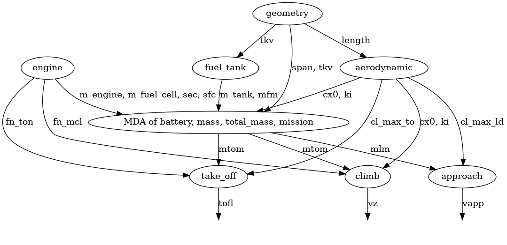
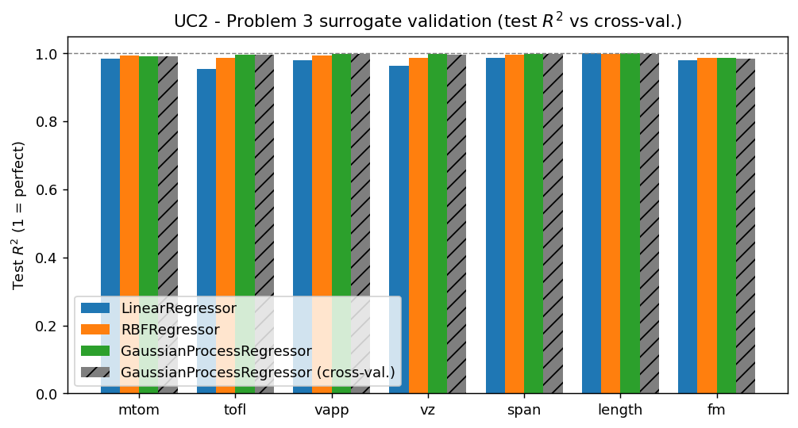
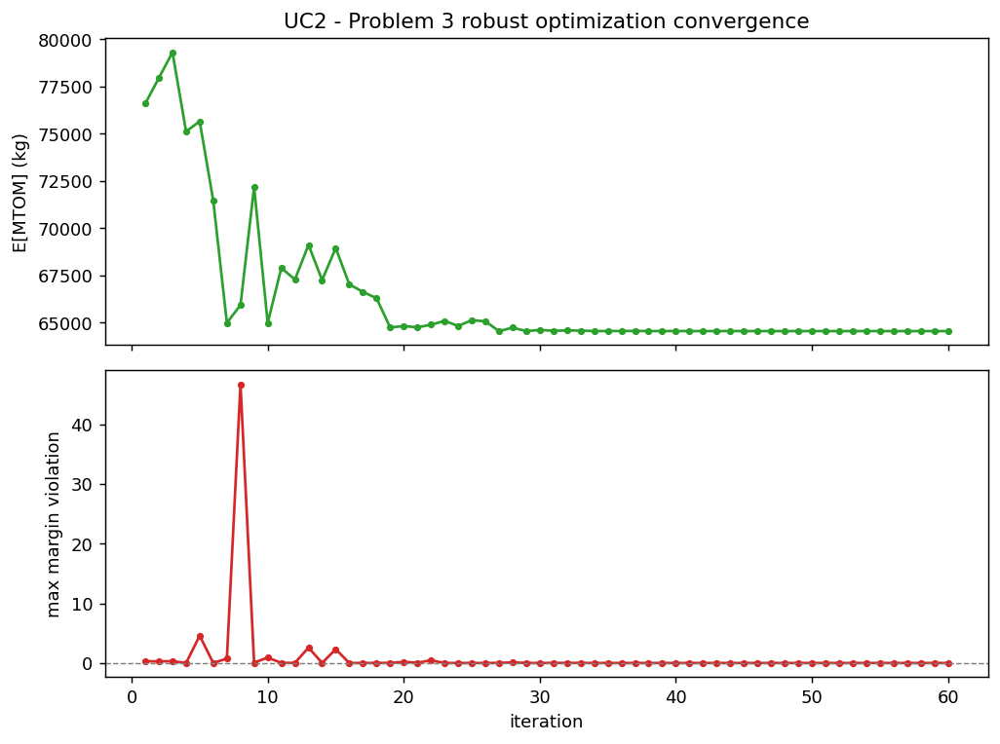
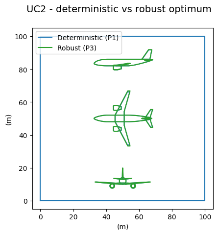

# Partie 3 — Modèle surrogate et optimisation robuste

**Objectif.** Construire un surrogate `f̂(x, u) = f(x, u)` sur **à la fois** les
paramètres de conception et les paramètres incertains, puis réaliser une
**optimisation robuste** : minimiser la masse maximale au décollage *espérée*
`E[mtom]` tout en imposant chaque contrainte avec une marge de sécurité
`mean ± kσ` (ici `k = 2`). C'est un **proxy de robustesse fondé sur les moments**,
pas une garantie probabiliste : avec des sorties non gaussiennes (triangulaires,
non linéaires), la bande `k = 2` ne certifie *pas* une fiabilité de 97,7 % — les
fiabilités réelles sont **mesurées par Monte-Carlo** ci-dessous plutôt que
supposées.

**Méthode.** Un plan en hypercube latin conjoint (10 × dimension) entraîne le
surrogate ; les modèles linéaire, RBF et **krigeage** (processus gaussien) sont
comparés sur un jeu de test. Le scénario robuste (`gemseo-umdo`, `UMDOScenario`)
minimise la `Mean` du MTOM, estimée par un Monte-Carlo interne, sous les
contraintes de marge. Le surrogate ne sert qu'à *chercher* : les deux optima sont
ensuite **vérifiés sur le vrai modèle couplé** — le MTOM et les
fiabilités rapportés sont lus sur `f`, pas sur `f̂`, en propageant les
incertitudes à travers le vrai modèle à chaque conception.

---

## Cas d'usage 2 — Hydrogène liquide / Turbofan

### Plan d'expériences conjoint et validation du surrogate

Le modèle OAD est un véritable système multidisciplinaire : les disciplines sont
liées par une boucle de rétroaction sur la masse au décollage, résolue par une
analyse multidisciplinaire (MDA) à **chaque** échantillon du plan d'expériences.
Le graphe de couplage condensé le rend explicite — `mass`, `total_mass` et
`mission` (plus le silencieux `battery`) forment le cœur fortement couplé,
alimenté par `geometry`, `aerodynamic` et `engine`, et alimentant à leur tour les
contraintes de décollage, d'approche et de montée.

Dans l'espace conjoint à 9 dimensions, on conserve le modèle de **krigeage**
(processus gaussien). Les modèles linéaire, RBF et krigeage atteignent tous un R²
global élevé pour le MTOM (≈ 0,98–0,99), mais l'optimum se situe dans un *coin* de
l'espace conjoint (`slst` et `n_pax` sur leurs bornes inférieures) où un plan
space-filling est clairsemé et où le RBF revient vers la moyenne d'entraînement —
sur-estimant alors le MTOM d'environ 2 %. Le processus gaussien est bien mieux
calibré sur les **contraintes** dans cette région (R² de test pour `vapp`, `vz`,
`tofl`, `span` tous ≥ 0,997 contre ≈ 0,96–0,99 pour le RBF), ce qui permet à
l'optimiseur de localiser la bonne conception. Une **validation croisée** K-fold
confirme l'absence de sur-apprentissage (R² CV = 0,991 pour le MTOM, ≥ 0,98 pour
chaque sortie) ; les barres hachurées grises montrent qu'elle suit le R² de test
du découpage unique. Le plan d'expériences et toutes les étapes de Monte-Carlo
sont tirés avec une graine fixe, donc les figures sont reproductibles.

Malgré cela, un surrogate n'est qu'une approximation : à l'optimum, le processus
gaussien sur-estime encore le MTOM d'environ 0,5 % (≈ 300 kg). On **vérifie donc
l'optimum sur le vrai modèle**, et ce sont ces valeurs qui sont rapportées
ci-dessous.

### Optimisation robuste

Ici la robustesse est essentielle. L'optimum robuste
(`slst = 100 kN`, `n_pax = 120`, `area = 117,9 m²`, `ar = 9,53`) a un MTOM nominal
réel de **≈ 63 650 kg (~63,6 t)**. En propageant les mêmes incertitudes à travers
le **vrai** modèle à chaque conception, son MTOM espéré est de **64 329 kg**
contre **64 202 kg** pour la conception déterministe — soit un **prix de la
robustesse de seulement +127 kg (+0,2 %)**. (`slst` et `n_pax` sont sur leurs
bornes inférieures pour les *deux* conceptions : l'optimiseur veut une poussée
minimale et le moins de passagers possible pour réduire la masse, donc ces deux
variables sont fixées par le plancher de l'espace de conception, pas par les
contraintes.)

Cette figure est calculée sur le **vrai modèle**.
La conception déterministe (optimale au nominal) est **probabilistiquement
fragile** : sous les incertitudes technologiques, elle ne satisfait la contrainte
de **taux de montée** `vz` que **11,8 %** du temps, la **marge de carburant** `fm`
**46,4 %**, et la longueur de piste au décollage `tofl` **88,2 %** — elle est
optimale au point nominal mais se trouve juste sur ces frontières de contraintes,
si bien que tout tirage défavorable de `gi`/`vi`/`cef` les viole. La conception
robuste relève toutes les contraintes à **≥ 98 %** (`vz` 99,7 %, `fm` 98,5 %,
`tofl` 98,2 %, `vapp` 100 %) en **agrandissant l'aile et en augmentant son
allongement** (area 117,9 vs 115,5 m², `ar` 9,53 vs 8,82), ce qui améliore la
finesse (rapport portance/traînée) — réduisant le carburant de mission pour
restaurer la marge — pour le coût en masse très modeste indiqué ci-dessus. La
conception hydrogène robuste est donc nettement préférable à la déterministe.

