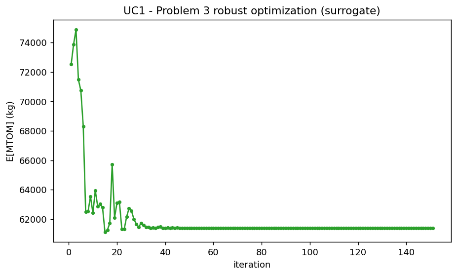
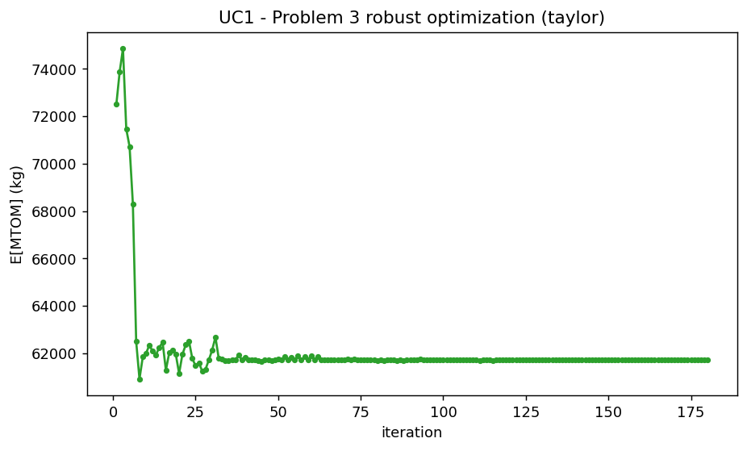

# Partie 3 — Modèle surrogate et optimisation robuste

## Objectif et méthode

Le Problème 3 construit un surrogate $\hat{f}(x, u) = f(x, u)$ sur **à la fois** les
paramètres de conception et les paramètres incertains, puis mène une **optimisation
robuste** : minimiser la masse maximale au décollage *espérée* `E[mtom]` tout en
imposant chaque contrainte avec une marge de sécurité $\text{moyenne} \pm k\sigma$
(ici $k = 2$) :

$$
\min_{x} \; \mathbb{E}[\texttt{mtom}(x, u)]
\quad \text{sous} \quad \mathbb{E}[g(x,u)] + k\,\mathbb{S}[g(x,u)] \le 0.
$$

C'est un **proxy de robustesse fondé sur les moments**, pas une garantie
probabiliste : avec des sorties non gaussiennes (lois triangulaires, non
linéarités), la bande $k = 2$ ne certifie *pas* une fiabilité de 97,7 % — les
fiabilités réelles sont **mesurées par Monte-Carlo** plutôt que supposées.

L'espérance $\mathbb{E}$ et l'écart-type $\mathbb{S}$ doivent être estimés à chaque
itération de l'optimiseur, ce qui exige de propager les incertitudes à travers le
modèle. Trois approches sont possibles :

- **`surrogate`** : on échantillonne un krigeage de $\hat{f}(x, u)$ — peu coûteux
  par itération ;
- **`sampling`** : Monte-Carlo direct sur le modèle multidisciplinaire — $N$
  réalisations i.i.d. de $u$, MDA résolue pour chacune ;
- **`taylor`** : développement de Taylor au premier ordre autour de la moyenne —
  sans tirage aléatoire.

Les deux filières sont traitées : pour le **kérosène (UC1)**, on compare ces trois
méthodes d'estimation ; pour l'**hydrogène liquide (UC2)**, on déroule le pipeline
complet (plan d'expériences conjoint, krigeage, optimisation robuste, puis
**vérification sur le vrai modèle**). L'algorithme retenu est `NLOPT_COBYLA`
(cohérent avec la Partie 1).

---

## Cas d'usage 1 — Kérosène / Turbofan : comparaison des méthodes d'estimation

Pour cette comparaison, on conserve la formulation étendue à 7 variables
incertaines (`gi`, `vi`, `aef`, `cef`, `sef`, `fc_pwd`, `bed`) et les disciplines
incluant `operating_cost`. L'objectif est ici **méthodologique** : comparer le
comportement des trois estimateurs de statistiques, non de produire un optimum
directement comparable au pipeline canonique UC2.

### a. Approche par surrogate

Cette méthode s'appuie sur un krigeage de $\hat{f}(x, u)$, ré-échantillonné à
chaque itération :

$$
\mathbb{E}[f(x,u)] \approx \frac{1}{N} \sum_{j=1}^{N} \hat{f}(x, u^{(j)}).
$$

### b. Approche par échantillonnage (Monte-Carlo)

L'échantillonnage direct applique Monte-Carlo sur le modèle multidisciplinaire : à
chaque itération $k$ de l'optimiseur, on génère $N$ réalisations i.i.d. de $u$ et la
MDA est entièrement résolue pour chacune :

$$
\mathbb{E}[f(x^{(k)}, u)] \approx \frac{1}{N} \sum_{j=1}^{N} f(x^{(k)}, u^{(j)}).
$$

### c. Approche par polynôme de Taylor

Plutôt que des tirages, on s'appuie sur un développement de Taylor au premier ordre
autour de la moyenne $\mu = \mathbb{E}[U]$ :

$$
f(x, U) \approx f(x, \mu) + (U - \mu)\, f'(x, \mu).
$$

Comme $\mathbb{E}[U - \mu] = 0$, on a $\mathbb{E}[f(x, U)] \approx f(x, \mu)$ et
$\mathbb{V}[f(x, U)] \approx \sigma^2 \big(f'(x, \mu)\big)^2$ ; l'écart-type
$\mathbb{S}$ découle de la racine de la variance.

### Résultats et comparaison

| Méthode | E[MTOM] (kg) | `slst` | `n_pax` | `area` | `ar` |
|:---|:---:|:---:|:---:|:---:|:---:|
| `surrogate` | 61 395 | 100 kN | 120 | 112,5 | 14,22 |
| `sampling` (MC) | 61 489 | 100 kN | 120 | 114,9 | 13,92 |
| `taylor` | 61 713 | 105,7 kN | 120 | 113,0 | 14,16 |

Les trois méthodes convergent vers des conceptions proches (E[MTOM] à $\approx$ 0,5 %
près), ce qui valide la cohérence des estimateurs. Leurs comportements diffèrent
néanmoins :

- l'approche **MC** offre la trajectoire la plus lisse et l'optimum le plus léger
  ($\approx$ 74 itérations), car les 200 tirages lui donnent une bonne « vision » de la
  dispersion à chaque pas ;
- l'approche **Taylor** est la plus lente ($\approx$ 106 itérations) et traverse davantage
  de phases infaisables ; elle choisit une poussée plus élevée (`slst` $\approx$ 105,7 kN)
  et aboutit à un avion légèrement plus lourd, conséquence de l'approximation au
  premier ordre de la variance ;
- l'approche **surrogate** est la moins coûteuse par itération et donne un résultat
  très proche du MC, ce qui en fait le meilleur compromis coût/précision.

*(La variante `sampling`, qui résout la MDA du vrai modèle à chaque tirage, est
extrêmement coûteuse ; ses valeurs sont reportées ici à titre de comparaison mais
sa courbe de convergence n'est pas régénérée dans cette exécution.)*

---

## Cas d'usage 2 — Hydrogène liquide / Turbofan : pipeline robuste complet

### Plan d'expériences conjoint et validation du surrogate

Le modèle OAD est un véritable système multidisciplinaire : les disciplines sont
liées par une boucle de rétroaction sur la masse au décollage, résolue par une
analyse multidisciplinaire (MDA) à **chaque** échantillon du plan d'expériences.
Le graphe de couplage condensé le rend explicite — `mass`, `total_mass` et
`mission` (plus le silencieux `battery`) forment le cœur fortement couplé,
alimenté par `geometry`, `aerodynamic` et `engine`, et alimentant à leur tour les
contraintes de décollage, d'approche et de montée.

Dans l'espace conjoint à 9 dimensions, on conserve le modèle de **krigeage**
(processus gaussien). Les modèles linéaire, RBF et krigeage atteignent tous un R$^{2}$
global élevé pour le MTOM ($\approx$ 0,98–0,99), mais l'optimum se situe dans un *coin* de
l'espace conjoint (`slst` et `n_pax` sur leurs bornes inférieures) où un plan
space-filling est clairsemé et où le RBF revient vers la moyenne d'entraînement —
sur-estimant alors le MTOM d'environ 2 %. Le processus gaussien est bien mieux
calibré sur les **contraintes** dans cette région (R$^{2}$ de test pour `vapp`, `vz`,
`tofl`, `span` tous $\geq$ 0,997 contre $\approx$ 0,96–0,99 pour le RBF), ce qui permet à
l'optimiseur de localiser la bonne conception. Une **validation croisée** K-fold
confirme l'absence de sur-apprentissage (R$^{2}$ CV = 0,991 pour le MTOM, $\geq$ 0,98 pour
chaque sortie) ; les barres hachurées grises montrent qu'elle suit le R$^{2}$ de test
du découpage unique. Le plan d'expériences et toutes les étapes de Monte-Carlo
sont tirés avec une graine fixe, donc les figures sont reproductibles.

Malgré cela, un surrogate n'est qu'une approximation : à l'optimum, le processus
gaussien sur-estime encore le MTOM d'environ 0,5 % ($\approx$ 300 kg). On **vérifie donc
l'optimum sur le vrai modèle**, et ce sont ces valeurs qui sont rapportées
ci-dessous.

### Optimisation robuste

Ici la robustesse est essentielle. L'optimum robuste
(`slst` = 100 kN, `n_pax` = 120, `area` = 117,9 m$^{2}$, `ar` = 9,53) a un MTOM nominal
réel de **$\approx$ 63 650 kg (~63,6 t)**. En propageant les mêmes incertitudes à travers
le **vrai** modèle à chaque conception, son MTOM espéré est de **64 329 kg** contre
**63 968 kg** pour la conception déterministe (l'optimum de la Partie 1,
`area` = 110,9 m$^{2}$, `ar` = 9,38) — soit un **prix de la robustesse de +361 kg
(+0,6 %)**. (`slst` et `n_pax` sont sur leurs bornes inférieures pour les *deux*
conceptions : l'optimiseur veut une poussée minimale et le moins de passagers
possible pour réduire la masse, donc ces deux variables sont fixées par le plancher
de l'espace de conception, pas par les contraintes.)

Cette figure est calculée sur le **vrai modèle**. La conception déterministe
(optimale au nominal) est **probabilistiquement fragile** : sous les incertitudes
technologiques, elle ne satisfait la contrainte de **vitesse d'approche** `vapp`
que **0,6 %** du temps, la **distance de décollage** `tofl` **31,6 %**, la **marge
de carburant** `fm` **78,2 %** et le **taux de montée** `vz` **82,4 %**. C'est
cohérent avec la Partie 1, où cet optimum nominal était déjà juste à la limite de
`vapp` ($\approx$ 69,7 contre 69,45 m/s) et de `tofl` : il est optimal au point nominal
mais posé sur ces frontières, si bien que tout tirage défavorable de
`gi`/`vi`/`sef` les viole. La conception robuste relève toutes les contraintes à
**$\geq$ 98 %** (`vapp` 100 %, `vz` 99,7 %, `fm` 98,5 %, `tofl` 98,2 %) en
**agrandissant l'aile et en augmentant son allongement** (`area` 117,9 vs 110,9 m$^{2}$,
`ar` 9,53 vs 9,38), ce qui améliore la finesse (rapport portance/traînée) — réduit
le carburant de mission, restaure la marge et abaisse la vitesse d'approche — pour
le coût en masse très modeste indiqué ci-dessus. La conception hydrogène robuste
est donc nettement préférable à la déterministe.

---

## Synthèse de la Partie 3

- Les **trois méthodes d'estimation** des statistiques (surrogate, MC, Taylor)
  convergent vers des optima cohérents ($\approx$ 0,5 % d'écart sur E[MTOM]) ; l'approche
  **surrogate** offre le meilleur compromis coût/précision, le MC la trajectoire la
  plus lisse, et Taylor reste le plus lent et le plus conservateur.
- Pour l'hydrogène liquide, l'**optimisation robuste** est décisive : la conception
  déterministe de la Partie 1, optimale au nominal mais saturant `vapp` et `tofl`,
  ne respecte ces contraintes que **0,6 %** et **31,6 %** du temps sous
  incertitudes. La conception robuste rétablit **toutes** les fiabilités à $\geq$ 98 %.
- Ce gain de fiabilité s'obtient pour un **surcoût de masse minime** (+361 kg,
  +0,6 % sur E[MTOM]), en agrandissant légèrement la voilure : la robustesse est
  ici quasi gratuite au regard du risque qu'elle élimine.
- Enfin, **le surrogate ne sert qu'à chercher** : tous les chiffres rapportés
  (MTOM, fiabilités) sont lus sur le **vrai modèle**, le krigeage sur-estimant
  systématiquement le MTOM de $\approx$ 0,5 % dans le coin où se trouve l'optimum.
