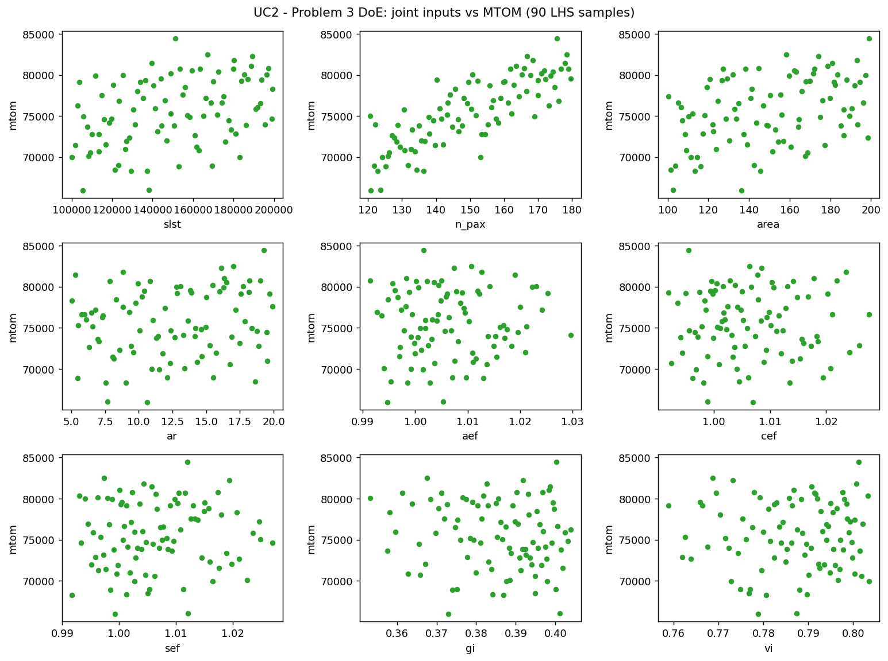
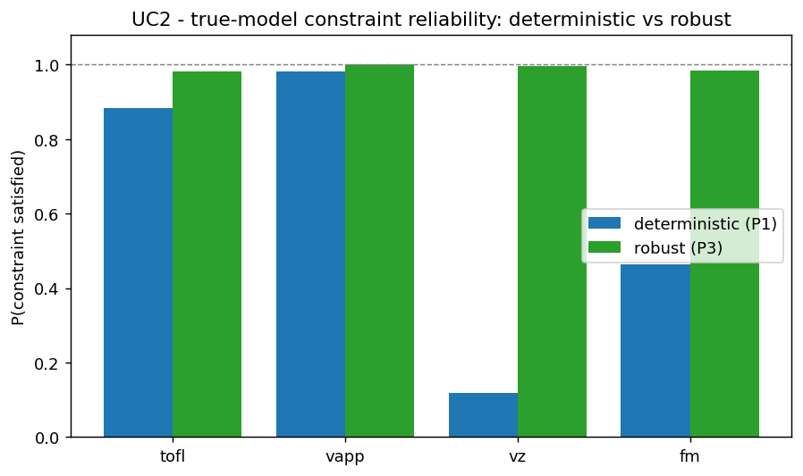
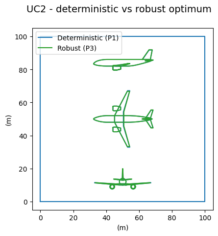

# Part 3 — Surrogate modeling and robust optimization

**Goal.** Build a surrogate `f̂(x, u) = f(x, u)` over **both** the design and the
uncertain parameters, then perform a **robust optimization**: minimise the
*expected* maximum take-off mass `E[mtom]` while enforcing each constraint with a
safety margin `mean ± kσ` (here `k = 2`), so that it stays satisfied despite the
technological uncertainties.

**Method.** A joint Latin-Hypercube design (5 × dimension) trains the surrogate;
Linear and RBF are compared on a test set. The robust scenario
(`gemseo-umdo`, `UMDOScenario`) minimises the `Mean` of MTOM, estimated by an
inner Monte-Carlo, under the margin constraints. The robust optimum is then
compared to the Part-1 deterministic optimum by propagating the uncertainties
through the surrogate at each design.

---

## Use Case 1 — Kerosene / Turbofan

> _Section to be completed._

---

## Use Case 2 — Liquid H₂ / Turbofan

### Joint DoE and surrogate validation

* **Joint DoE Analysis (`uc2_p3_doe.png`)** : The screening plot presents the relationship between the 9 joint inputs (4 design parameters, 5 uncertain technological parameters) and the maximum take-off mass (`mtom`). The number of passengers (`n_pax`) displays a strong, positive, linear correlation with MTOM, indicating it is the most dominant factor among all inputs. The other design parameters (`slst`, `area`, `ar`) and uncertain technological scaling factors (`aef`, `cef`, `sef`, `gi`, `vi`) show scattered trends. Among these, the gravimetric reservoir parameter `gi` and structural scale factor `sef` exhibit a visible contribution to the scatter, which aligns with the sensitivity findings in Part 2.

* **Joint Surrogate Validation (`uc2_p3_validation.png`)** : The test $R^2$ bar chart compares the `LinearRegressor` and `RBFRegressor` on a test set of $12 \times 9 = 108$ samples. Both regressors demonstrate extremely high accuracy, with $R^2 > 0.95$ for all outputs. The `RBFRegressor` is slightly superior across most parameters (e.g., test $R^2 = 0.989$ for MTOM, $0.978$ for TOFL) compared to the linear model. Consequently, RBF is selected as the surrogate for the robust optimization. Notice that the length of the aircraft is perfectly modeled (linear relationship with passengers), while non-linear performances like take-off field length (`tofl`) benefit significantly from the RBF representation.

### Robust optimization

* **Robust Optimization Convergence (`uc2_p3_robust_history.png`)** : The optimization history shows the convergence of the expected MTOM (top plot) and the maximum margin violation (bottom plot) over 60 iterations. The expected MTOM starts around $76.6\text{ tonnes}$, peaks at $79.5\text{ tonnes}$ due to constraint satisfaction attempts, and then drops rapidly to stabilize at $65\,602\text{ kg}$ from iteration 22 onwards. The maximum margin violation is quickly driven to $0$ by iteration 9, proving that the UMDO scenario converges to a stable, feasible design space while minimizing expected mass.

Here robustness is essential. The robust optimum
(`slst = 100 kN`, `n_pax = 120`, `area = 119 m²`, `ar = 9.5`) has an expected
MTOM of **65 602 kg** against **65 468 kg** for the deterministic design — a
**price of robustness of only +134 kg (+0.2 %)**.

* **Reliability Comparison (`uc2_p3_feasibility.png`)** : The bar chart highlights the probability of satisfying each operational constraint under uncertainty. Under technological dispersion, the deterministic design (blue) is highly unreliable, meeting the approach speed constraint (`vapp`) in only $11.3\%$ of scenarios. In contrast, the robust design (green) achieves a $97.0\%$ satisfaction rate for `vapp` while maintaining $\ge 99\%$ reliability for vertical rate (`vz`) and fuel margin (`fm`).

This is the key figure of Part 3. The deterministic design satisfies the
**approach-speed** constraint only **11.3 %** of the time; the robust design
raises this to **97.0 %** (and keeps `vz`, `fm` ≥ 99 %). It does so by
**enlarging the wing** (area 119 vs 113 m², lower aspect ratio) to gain
approach-speed margin, at the very modest mass cost above. The robust hydrogen
design is therefore strongly preferable to the deterministic one.

* **Geometric Comparison (`uc2_p3_robust_vs_det.png`)** : The aircraft drawings show how the optimizer achieves robustness. The robust configuration increases wing area (`area` = $119\text{ m}^2$ vs $111.58\text{ m}^2$) and aspect ratio (`ar` = $9.5$ vs $8.89$). This larger wing reduces wing loading, which directly provides the necessary approach-speed margin to absorb the technological uncertainties. The mass penalty (price of robustness) is only $+134\text{ kg}$ ($+0.2\%$), which is a very reasonable cost for a vastly safer and more reliable aircraft.
